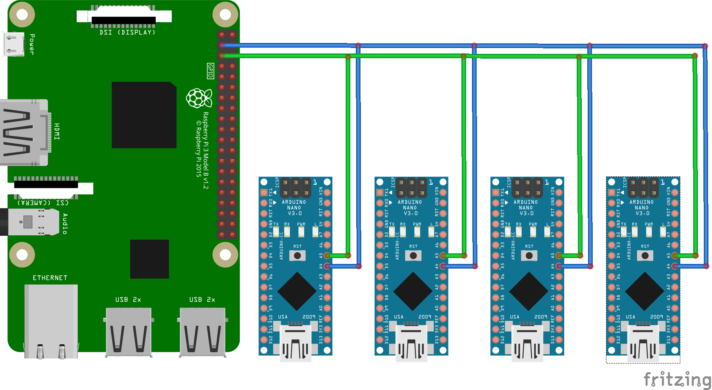

# Delta 5 Race Timer

### Description:

Multi-node video RF race timer for drone racing.  This timing system uses the video signals being broadcast by FPV racing drones to trigger a lap timer; no additional equipment required on the drone. Each receiver node is tuned to the video frequency that a drone is broadcasting on.  One receiver node is required for each frequency being tracked.  All of the receiver nodes are connected to a raspberry pi, which aggregates the data and also provides a simple GUI for the race director.

This is the description for the 6 Receiver Node version, but you can add as many Receiver Nodes as you like and the code will need to be modified accordingly. 

### Facebook Group page:
Have questions? Comments? Join us at the Delta 5 Race Timer Facebook Group page and we'll try to help troubleshoot.
https://www.facebook.com/groups/Delta5RaceTimer/

### Video Demo (Note: video shows the shows 4 Receiver Node version):
https://youtu.be/UdelgqwngX4

### Base Station:
* 1 x Raspberry Pi 3 (Other Raspberry Pi models should work, but this was tested on RPi3)

### Receiver Node Parts List: (this is enough for one receiver node)
* 1 x Arduino Nano
* 1 x rx5808 with SPI mod - see the SPI mod here: https://github.com/scottgchin/delta5_race_timer/blob/master/rx5808_SPI/rx5808_SPI.md
* 3 x 1k ohm resistor
* 1 x 100k ohm resistor

### Receiver Node Connection Diagram:


### Receiver Node Arduino Code:
1. Open the Delta 5 Race Timer in the Arduino IDE.
2. Change the slave address on each Receiver Node so that each one has a unique slave address.  Currently the RPi will recognize the following:
  * Node 1 = slave address 8
  * Node 2 = slave address 10
  * Node 3 = slave address 12
  * Node 4 = slave address 14
  * Node 5 = slave address 16
  * Node 6 = slave address 18
  
3. Change the frequency to match the VTX frequency.  The below are the IMD 6 settings, but refer to the channels.pdf document if you want to use a different frequency. The numbers match the position in the channel array.
  * E2 (5685) = 17  
  * F2 (5760) = 25  
  * F4 (5800) = 27  
  * F7 (5860) = 30  
  * E6 (5905) = 21
  * E4 (5645) = 19  
  
### Raspberry Pi LAMP Server Setup:
1. Start by instaling Raspbian. Follow the official instructions here: https://www.raspberrypi.org/downloads/raspbian/
2. Install Apache
 ```
 sudo apt-get install apache2 -y
 ```
 Test to make sure Apache is running by going to ```http://localhost/``` in the RPi's browser.

3. Install PHP
 ```
 sudo apt-get install php5 libapache2-mod-php5 -y
 ```

4. Install MySQL
 ```
 sudo apt-get install mysql-server php5-mysql -y
 ```

5. Restart Apache
 ```
 sudo service apache2 restart
 ```
 
6. Enable I2C on the Raspberry Pi
 ```
 sudo raspi-config
 ```
 Go to Advanced Options, and enable I2C

7. Install PHPMyAdmin
```
sudo apt-get install phpmyadmin
```
Select Apache2 as the server installed, answer 'YES' to the 'Configure database for PHPMyAdmin with dbconfig-common?"
It will then ask you for the password when you created the MySQL database in Step 4.  It will also ask to setup a password for PHPMyAdmin, just make it the same as MySQL

8. Setup Apache to include our PHPMyAdmin installation
```
sudo nano /etc/apache2/apache2.conf
```
At the bottom of the file add the following line:
```
Include /etc/phpmyadmin/apache.conf
```

9. Restart Apache:
```
sudo service apache2 restart
```

10. Install Python.
```
sudo apt-get install python-dev
```
and install the python drivers for the GPIO
```
sudo apt-get install python-rpi.gpio
```
11. Give permission to run scripts as sudo
```
sudo nano /etc/sudoers
```
At the bottom of the file add the following:
```
www-data ALL=(root) NOPASSWD:ALL
```

12. Update just to make sure everything is in order
```
sudo apt-get update && sudo apt-get upgrade
```

13. Install the python bindings for MySQL
```
sudo apt-get install mysql-server python-mysqldb
```

### MySQL Database setup:
1. Access PHPMyAdmin from the browser.
From the browser on the pi enter the following to access PHPMyAdmin:
```
http://127.0.0.1/phpmyadmin
```
This will allow you to setup the MySQL database using the easy PHPMyAdmin GUI.

2. Create a database called 'vtx'

3. Create a table under 'vtx' called 'races' with the following columns: racegroup, race, pilot, lap, min, sec, millisec

4. Create a table under 'vtx' called 'setup' with the following columns: ID, startstop, trig1, trig2, trig3, trig4, trig5, trig6

5. Create an entry in the 'setup' table with an ID of 1.  All the other values can be set to zero.


### Raspberry Pi to Ardunio i2c Connection Diagram:
I2C allows 50+ devices to be connected to the Raspberry Pi. Each Receiver Node that is connected needs a different slave address.  Currently the Raspberry Pi code is designed for 6 receiver nodes (the diagram only shows 4 Receiver Nodes connected).  Note: be sure all Receiver Nodes and the Raspberry pi are tied to a common ground; if not, the i2c messages can be corrupted, and cause other strange things to happen.



### To Do and Known issues 
* Add on screen countdown timer.
* Add Pilot profiles (Name, handle, etc.).
* Add Race Heats.
* Add Save race results.
* Add adjustable trigger threshold on GUI.
* Add frequency selection on GUI.
* Add indication that the first trigger has been read on GUI.
* Update Start/Stop button to indicate if race state.
* Setup i2c comms as a function.
