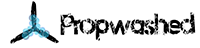

# RotorHazard
FPV Race Timing and Event Management

A multi-node radio frequency race timing system for FPV drone racing, with event management. Uses 5.8GHz video signals broadcast by drones to trigger lap times. Each node listens on a specified frequency and communicates times to a central server (raspberry pi). The server manages a front-end interface, which any device on the same network can connect to via web browser.

RotorHazard builds on the [Delta5 Race Timer](https://github.com/scottgchin/delta5_race_timer), and supports up to 8 nodes.

## Major Features
* Timing and event management on the same hardware
* Modern, mobile-friendly, and highly responsive user interface
* Manage pilots, heats, race classes, race formats, and tuning profiles
* LED and audio support to indicate race staging, starts, and other events
* Real-time statistics and race history
* Fine control of filtering and calibration allows indoor and outdoor use, even in difficult multipathing environments
* Supports all frequencies in the 5.8GHz band
* Includes basic support for Team racing and most-laps-wins races

## Hardware and Software Setup
To build and configure the system, follow the instructions here:  
[doc/Hardware Setup.md](doc/Hardware%20Setup.md)  
[doc/Software Setup.md](doc/Software%20Setup.md)

## User Guide
For initial setup and running races, follow these instructions: [doc/User Guide.md](doc/User%20Guide.md)

## Migrating from/to Delta5
RotorHazard uses the same hardware, but different code for the nodes. Re-flash your Arduinos as in the [setup instructions](doc/Software%20Setup.md#receiver-nodes-arduinos) whenever you switch between the two projects.

## Contributors
* Michael Niggel
* Eric Thomas
* Klaus Michael Schneider
* Scott Chin and other [Delta5](https://github.com/scottgchin/delta5_race_timer) Contributors

### Supported by:

### Translators
* Dutch: Kenny Van Der Sypt
* German: Klaus Michael Schneider
* Spanish: Ramon Hernandez Roldan

## Feedback

Discuss RotorHazard on Facebook:  https://www.facebook.com/groups/rotorhazard

To report bugs or request features, please post a GitHub issue [here](https://github.com/RotorHazard/RotorHazard/issues).

Community contributions are welcome and encouraged; see the [Development.md](doc/Development.md) doc for more info.