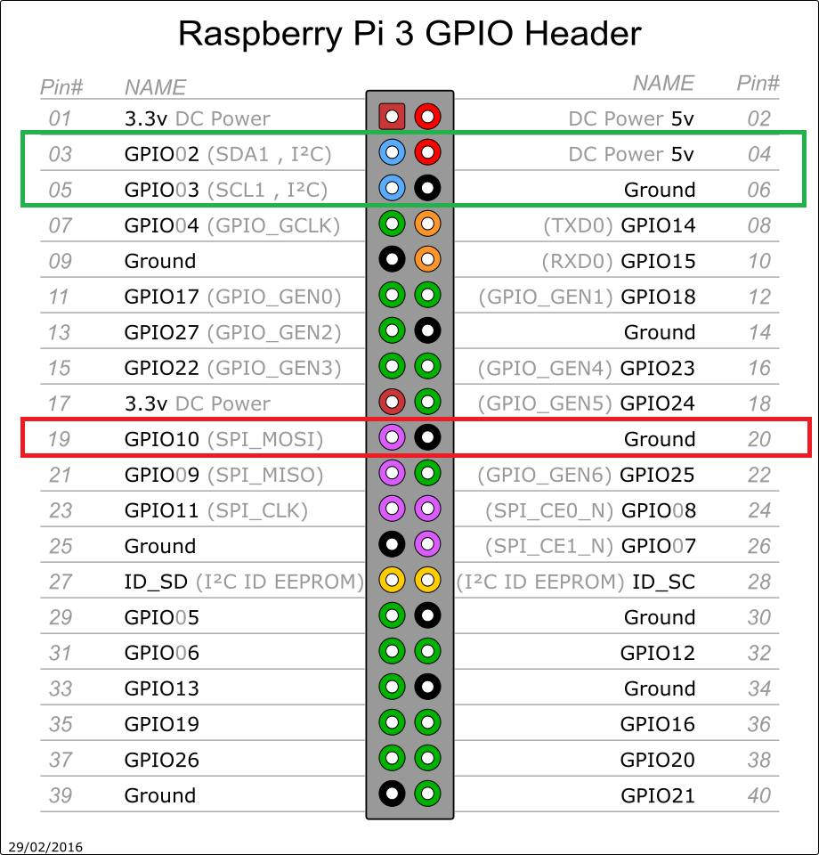

# Hardware Setup Instructions

## Parts List

### Receiver Node(s) (this list makes one node, build up to eight)
* 1 x [Arduino Nano](https://www.ebay.com/sch/i.html?_nkw=Arduino+Nano+V3.0+16M+5V+ATmega328P)
* 1 x [RX5808 module](https://www.banggood.com/search/rx5808-module.html) with SPI mod (modules with date code 20120322 are known to work)
* 3 x 1k ohm resistor
* 1 x 100k ohm resistor
* 26 AWG and 30 AWG silicone wire

### System Components
* 1 x Raspberry Pi3 (Pi2 users have reported issues with multiple nodes connected)
* 8 GB (minimum) Micro SD Card
* 26 AWG and 30 AWG silicone wire (for wiring to each receiver node)
* 3D printed case for housing the electronics
* 5V power supply, 3 amp minimum (or 12V power supply if onboard regulators are used)

### Additional Components
* [RF shielding](Shielding%20and%20Course%20Position.md)

### Optional Components
* Ethernet cable, 50ft plus
* Outdoor power cable, 50ft plus
* Network router
* Laptop/tablet
* ws2812b LEDs

## Hardware Setup

### RX5808 Video Receivers
Make sure your receivers support SPI. *Most RX5808 modules on sale today already arrive with SPI enabled.* If they do not, modify the RX5808 receivers to enable SPI support as follows:

Remove the shield from the RX5808, the shield is normally held on by a few spots of solder around the edges. Use some solder wick to remove the solder and free the shield from the receiver. Be careful not to damage any ground pads on the receiver. There are usually small holes around the edge you can use to help push off the shield.

Remove the following resistor:


The shield should be soldered back in place after removing the resistor.

### Receiver Nodes
Complete wiring connections between each Arduino and RX5808.


Note: A simple receiver node may also be constructed and attached via USB -- see [doc/USB Nodes.md](USB%20Nodes.md).

### System Assembly
Complete wiring connections between each Arduino and the Raspberry Pi.

Note: be sure all Receiver Nodes and the Raspberry Pi are tied to a common ground; if not, the i2c messages can be corrupted.


### Add a Directional RF Shield
A directional RF shield significantly improves the system's ability to reject false passes. See [RF shielding](Shielding%20and%20Course%20Position.md)

### Real Time Clock
See '[doc/Real Time Clock.md](Real%20Time%20Clock.md)' for more information on installing a real-time clock module to improve how the system maintains its date and time.

### WS2812b LED Support
The pins in the green box is what were already used by the timer. The pins in the red box is where you connect the signal and ground from the ws2812b LEDs.  The LEDs will require a separate power source. See WS2812b LED support under [doc/Software Setup.md](Software%20Setup.md).



### Additional Sensors
Sensors (such as BME280 and INA219) may be attached to the I2C bus and power pins. See the '..._sensor.py' files in the "src/interface" directory for implementation examples. The sensors need to be specified in the "src/server/config.json" file -- in the sample configuration below, a BME280 sensor is configured at I2C address 0x76 (as "Climate") and a INA219 sensor is configured at address 0x40 (as "Battery").
```
    "SENSORS": {
            "i2c:0x76": {
                    "name": "Climate"
            },
            "i2c:0x40": {
                    "name": "Battery",
                    "max_current": 0.1
            }
    },
```
Note that BME280 and INA219 sensors require the installation of support libraries -- see [doc/Software Setup.md](Software%20Setup.md#ina219-voltagecurrent-support).

### Multiple Timers
Multiple RotorHazard timers may be connected together (i.e., for split timing and mirroring) -- see [doc/Cluster.md](Cluster.md).

-----------------------------

See Also:<br/>
[doc/USB Nodes.md](USB%20Nodes.md)<br/>
[doc/Software Setup.md](Software%20Setup.md)<br/>
[doc/User Guide.md](User%20Guide.md)<br/>
[Build Resources (PCB, etc)](../resources)
