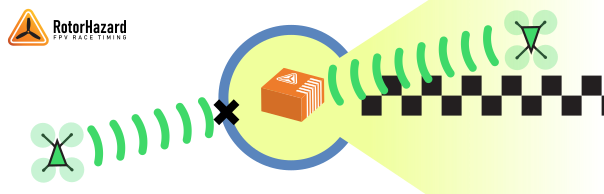
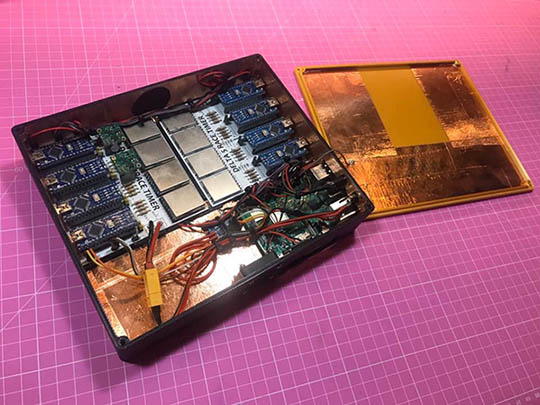
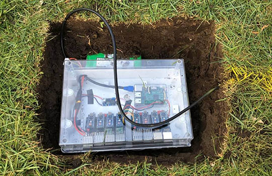
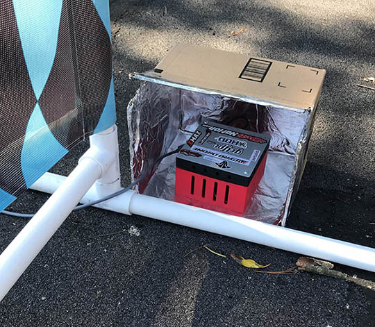

# Shielding and Course Position

## Add a Directional RF Shield

A directional RF shield significantly improves the system's ability to reject false passes. This improves the timer's ability to collect accurate timing data, and allows operators to design courses that pass closely to the timing gate. 

Construct a directional shield that leaves a line of sight open between the timer and the timing gate, but blocks or attenuates RF signals from other directions. The most popular options to accomplish this are:

* Place the system inside a metal box with one side open, such as an ammo can, paint can, metal bucket, or computer case.
* Dig a hole into the ground and place your case within it.
* Line your system case with copper tape.

It is recommended to attach the electrical ground on the timer to your shield.

### Examples

Lining a case with copper tape is a common method of creating a directional shield.

_Courtesy Cerberus Velvet_

Outdoors, digging a hole can make use of the ground for basic shielding.

_Courtesy Sebi Wburg_

## Timer Positioning

The RF shield works best when you can block most of the race course while leaving the timer exposed from the direction of the timing gate.

* Place the timer just outside the gate post.
* Place the timer on the inner side of the course line, facing outward and away from the rest of the course. 
* Avoid having the course cross in front of the timer.

### Examples

Place the opening of the shield toward the gate, blocking the course beside and behind. A cardboard box simply wrapped in aluminum foil can be very effective.

_Courtesy Mark Silva_

From the pilot station and race operations outside of the course, you should be able to see the timer inside its shield.

_Courtesy Roger Bess_
