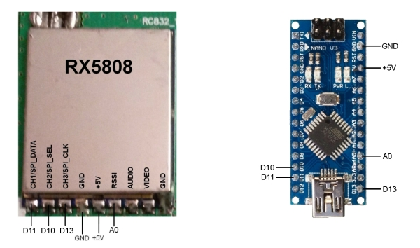
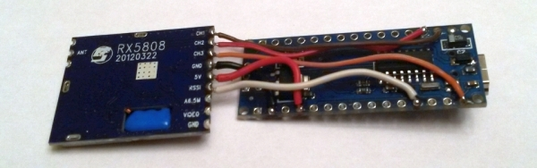
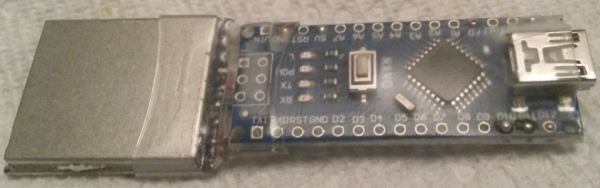

# USB Nodes

Hardware nodes may be connected into the system via USB.  A node can be created with an Arduino, an RX5808 module, and six wires; with the connections shown below.





The above build uses an Arduino Nano V3.0 16M 5V ATmega328P module (which can be found on [eBay](https://www.ebay.com/sch/i.html?_nkw=Arduino+Nano+V3.0+16M+5V+ATmega328P)) and an RX5808 module (which can be found on [banggood](https://www.banggood.com/search/rx5808-module.html) and [eBay](https://www.ebay.com/sch/i.html?_nkw=rx5808+module)).

USB nodes may be plugged into the USB ports of the Raspberry Pi on a standard RotorHazard timer build, and they will appear in the system as serial ports.  If the timer also has "standard" (PCB-based) nodes, the USB/serial nodes will add to the total number of nodes available.  (Node counts of 9 or higher are possible.)

The nodes may also be attached (via USB) to [any computer running the RotorHazard server](Software%20Setup.md#otheros).  

USB nodes need to be configured in the "SERIAL_PORTS" section in the "src/server/config.json" file, as shown in the examples below.

#### Raspberry Pi

On the Raspberry Pi, an attached USB node will be referenced with a serial port name like "/dev/ttyUSB0".  The command ```ls /dev/ttyUSB*``` will show the current USB serial ports.  The "src/server/config.json" file should contain an entry like this:
```
	"SERIAL_PORTS": ["/dev/ttyUSB0"],
```
Multiple USB nodes would be configured like this:
```
	"SERIAL_PORTS": ["/dev/ttyUSB0","/dev/ttyUSB1"],
```

#### Windows Computer

On a Windows computer, an attached USB node will be referenced with a serial port name like "COM5".  The current ports may be viewed in the Windows Device Manager under "Ports (COM & LPT)" -- when the USB node is plugged in, its entry should appear.  It may be necessary to install or update its driver (named something like "USB-SERIAL").  The "src/server/config.json" file should contain an entry like this:
```
	"SERIAL_PORTS": ["COM5"],
```
Multiple USB nodes would be configured like this:
```
	"SERIAL_PORTS": ["COM5","COM6"],
```

#### Node Code

The RotorHazard node code will need to be uploaded (flashed) to the Arduino using [the "standard" method](https://github.com/RotorHazard/RotorHazard/blob/main/src/node/readme_Arduino.md) (via the Arduino IDE).  The NODE_NUMBER value (in "src/node/config.h") is ignored for USB nodes; it can be left at 0.

<br/>

-----------------------------

See Also:  
[doc/Hardware Setup.md](Hardware%20Setup.md)  
[doc/Software Setup.md](Software%20Setup.md)  
[doc/User Guide.md](User%20Guide.md)
