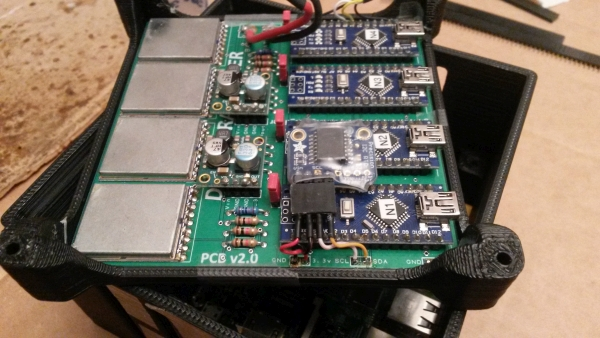

# Echtzeituhr

Der Standard-Raspberry Pi verfügt nicht über eine Echtzeituhr (RTC). Wenn er über eine Internetverbindung verfügt, ruft der Pi das aktuelle Datum und die aktuelle Uhrzeit von einem Online-Server ab. Wenn jedoch beim Starten des Pi keine Internetverbindung verfügbar ist , wird sein Datum / Uhrzeit falsch sein. (Normalerweise wird das zuletzt verwendete Datum / die letzte Uhrzeit wiederhergestellt und von dort aus fortgefahren.)

Das Hinzufügen eines Echtzeituhrmoduls behebt dieses Problem. Das Modul [DS3231](https://www.adafruit.com/product/3013) wird empfohlen, da es eine sehr genaue Zeit hält. Es gibt andere, billigere Module, die ebenfalls die Arbeit erledigen (wenn auch mit geringerer Präzision), wie [PCF8523](https://www.adafruit.com/product/3295) und [DS1307](https://www.adafruit.com/product/3296).

Das RTC-Modul verwendet eine integrierte Knopfzellenbatterie ([CR1220](https://www.adafruit.com/product/380)), mit der es die Zeit verfolgen kann, während das System ausgeschaltet ist.

### Verkabelung

Das RTC-Modul wird über den I2C-Bus mit dem Raspberry Pi verbunden. Die folgenden vier Pads am RTC-Modul müssen mit den entsprechenden Verbindungen zum Pi verbunden werden: "Vin, GND, SCL, SDA". Bei Verwendung des DS3231 oder PCF8523 kann das Vin-Pad an 3,3 V oder 5 V angeschlossen werden. Verwenden Sie für den DS1307 5V. Die anderen Pads (außer diesen vier) am RTC-Modul sollten nicht angeschlossen bleiben.

Hier ist ein Beispiel für die Verkabelung eines DS3231-Moduls über eine Delta5 V2-Platine:



Wenn Sie eine der neueren [RotorHazard PCBs](../resources/PCB/README.md) verwenden, gibt es mehrere Stellen auf der Karte, an denen diese Verbindungen verfügbar sind.

### Konfiguration

Die folgenden Anweisungen gelten für den Standard [Raspberry Pi OS](https://www.raspberrypi.org/downloads/raspberry-pi-os), der für RotorHazard installiert ist.

Führen Sie den folgenden Befehl aus, um sicherzustellen, dass das RTC-Modul ordnungsgemäß verdrahtet ist:

```
sudo i2cdetect -y 1
```

Die Antwort sollte ungefähr so aussehen:

```
     0  1  2  3  4  5  6  7  8  9  a  b  c  d  e  f
00:          -- -- -- -- -- 08 -- 0a -- 0c -- 0e --
10: 10 -- 12 -- 14 -- 16 -- -- -- -- -- -- -- -- --
20: -- -- -- -- -- -- -- -- -- -- -- -- -- -- -- --
30: -- -- -- -- -- -- -- -- -- -- -- -- -- -- -- --
40: -- -- -- -- -- -- -- -- -- -- -- -- -- -- -- --
50: -- -- -- -- -- -- -- -- -- -- -- -- -- -- -- --
60: -- -- -- -- -- -- -- -- 68 -- -- -- -- -- -- --
70: -- -- -- -- -- -- -- --
```

Die "68" repräsentiert die I2C-Adresse des RTC-Moduls. (Nachdem der Pi für die Verwendung des Moduls konfiguriert wurde, ändert sich dieser Wert in "UU".) Die Adressen von "08" bis "16" stellen die installierten Arduino-Knoten dar, und es gibt normalerweise 4 oder 8 Einträge (entsprechend der Anzahl von) Knoten).

Geben Sie den folgenden Befehl ein, um die Datei "/boot/config.txt" zu bearbeiten:

```
sudo nano /boot/config.txt
```

Wenn Sie den DS3231 verwenden, fügen Sie am Ende der Datei die folgende Zeile hinzu:

```
dtoverlay=i2c-rtc,ds3231
```

(Wenn Sie den PCF8523 verwenden, nehmen Sie `dtoverlay=i2c-rtc,pcf8523`. Wenn Sie den DS1307 verwenden, nehmen Sie `dtoverlay = i2c-rtc, ds1307`.)

Drücken Sie *Strg-O* und *Eingabe*, um die Datei zu speichern, und dann *Strg-X*, um den Editor zu verlassen.

Starten Sie zu diesem Zeitpunkt den Pi neu:

```
sudo reboot
```

Eine Startdienstdatei wird benötigt, damit der Pi die Zeit vom RTC-Modul liest, wenn das System startet. Geben Sie den folgenden Befehl ein, um diese Datei zu erstellen:

```
sudo nano /etc/systemd/system/hwclock-start.service
```

Kopieren Sie den folgenden Text und fügen Sie ihn in den Editor ein:

```
[Unit]
Description=hwclock-start to read rtc and write to system clock
After=sysinit.target

[Service]
Type=oneshot
ExecStart=/sbin/hwclock --hctosys --utc

[Install]
WantedBy=basic.target
```

Drücken Sie *Strg-O* und *Eingabe*, um die Datei zu speichern, und dann *Strg-X*, um den Editor zu verlassen.

Geben Sie die folgenden Befehle ein, um diesen Startdienst zu konfigurieren und zu aktivieren:

```
sudo chmod 644 /etc/systemd/system/hwclock-start.service
sudo chown root:root /etc/systemd/system/hwclock-start.service
sudo systemctl daemon-reload
sudo systemctl enable hwclock-start.service
sudo systemctl start hwclock-start.service
```

Zu diesem Zeitpunkt ist das RTC-Modul installiert und konfiguriert. Wenn der Pi startet, sollte er das Datum / die Uhrzeit vom RTC-Modul lesen und immer den richtigen Wert haben. Wenn der Pi über eine Internetverbindung verfügt, wird diese weiterhin zum Abrufen des aktuellen Datums und der aktuellen Uhrzeit verwendet und das RTC-Modul mit dem abgerufenen Datum und der abgerufenen Uhrzeit aktualisiert.

### Testen

Wenn Sie den Befehl `date` eingeben, wird die aktuelle Systemzeit des Pi angezeigt.

Der folgende Befehl kann verwendet werden, um die Datums- / Zeitwerte zu überprüfen:

```
timedatectl status
```

Die Antwort sollte ungefähr so aussehen:

```
               Local time: Sat 2020-08-29 19:15:01 EDT
           Universal time: Sat 2020-08-29 23:15:01 UTC
                 RTC time: Sat 2020-08-29 23:15:01
                Time zone: America/New_York (EDT, -0400)
System clock synchronized: yes
              NTP service: active
          RTC in local TZ: no
```

Wenn ein RTC-Modul nicht installiert ist oder nicht ordnungsgemäß funktioniert, lautet die dritte Zeile in der Antwort "RTC-Zeit: n/a".

Der Betrieb des RTC-Startdienstes kann mit dem folgenden Befehl überprüft werden:

```
journalctl -b | grep 'hwclock-start to read rtc'
```

Die Antwort sollte eine oder mehrere Instanzen ähnlicher Zeilen enthalten:

```
Aug 29 19:01:49 pi3number98 systemd[1]: Starting hwclock-start to read rtc and write to system clock...
Aug 29 19:01:51 pi3number98 systemd[1]: Started hwclock-start to read rtc and write to system clock.
```

Die aktuelle Zeit des RTC-Moduls kann über den Befehl `sudo hwclock -r` abgefragt werden. Durch hinzufügen des Parameters -D erhalten Sie zusätzliche Informationen: `sudo hwclock -D -r`

<br />

*Verweise:* Die Informationen in [diesem Forumsbeitrag](https://www.raspberrypi.org/forums/viewtopic.php?t=209700#p1572546) wurden beim Erstellen dieser Anweisungen verwendet.

---

Siehe auch:
[doc/Hardware Setup.md](de-Hardware%20Setup.md)
[doc/Software Setup.md](de-Software%20Setup.md)
