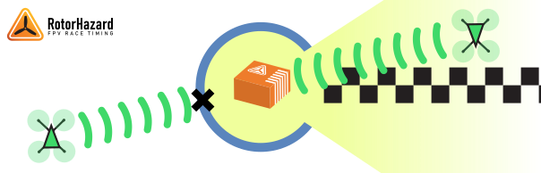
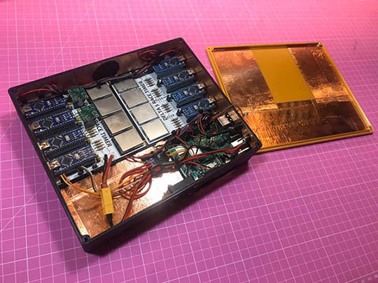
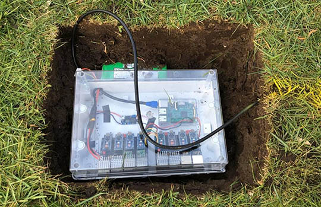
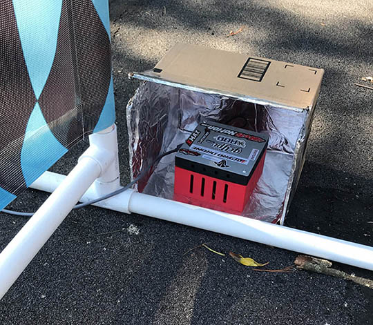
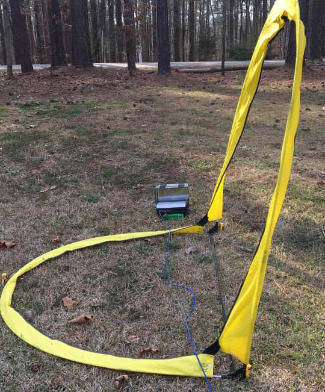

# Abschirmung und Kursposition

## Fügen Sie eine Richtungs-HF-Abschirmung hinzu

Eine gerichtete HF-Abschirmung verbessert die Fähigkeit des Systems, falsche Durchgänge abzulehnen, erheblich. Dies verbessert die Fähigkeit des Timers, genaue Timing-Daten zu erfassen, und ermöglicht es dem Bediener, Kurse zu entwerfen, die eng am Timing-Gate verlaufen.

Konstruieren Sie eine Richtungsabschirmung, die eine Sichtlinie zwischen dem Timer und dem Timing-Gate offen lässt, aber HF-Signale aus anderen Richtungen blockiert oder dämpft. Die beliebtesten Optionen, um dies zu erreichen, sind:

* Stellen Sie das System in eine Metallbox mit einer offenen Seite, z. B. eine Munitionsdose, eine Farbdose, einen Metalleimer oder ein Computergehäuse.
* Graben Sie ein Loch in den Boden und legen den Koffer hinein.
* Legen Sie Ihr Systemgehäuse mit Kupferband aus.

Es wird empfohlen, die elektrische Masse am Timer an Ihrem Schild anzubringen.

### Beispiele

Das Auskleiden eines Gehäuses mit Kupferband ist eine übliche Methode zum Erstellen einer Richtungsabschirmung.

_Mit freundlicher Genehmigung von Cerberus Velvet_

Im Freien kann beim Graben eines Lochs der Boden für die grundlegende Abschirmung genutzt werden.

_Mit freundlicher Genehmigung von Sebi Wburg_

## Timer-Positionierung

Die HF-Abschirmung funktioniert am besten, wenn Sie den größten Teil der Rennstrecke blockieren können, während der Timer aus der Richtung des Timing-Gates freigelegt bleibt.

* Stellen Sie den Timer direkt vor den Torpfosten.
* Platzieren Sie den Timer auf der Innenseite der Kurslinie, nach außen gerichtet und vom Rest des Kurses weg.
* Vermeiden Sie es, den Kurs vor dem Timer zu kreuzen.

### Beispiele

Platzieren Sie die Öffnung des Schildes in Richtung Tor und blockieren Sie den Kurs neben und hinter dem Tor. Ein Karton, der einfach in Aluminiumfolie eingewickelt ist, kann sehr effektiv sein.

_Mit freundlicher Genehmigung von Mark Silva_

Von der Pilotstation und dem Rennbetrieb außerhalb der Strecke sollten Sie den Timer in seinem Schild sehen können.

_Mit freundlicher Genehmigung von Roger Bess_
