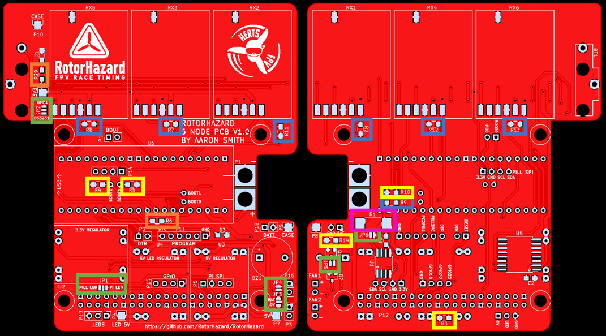
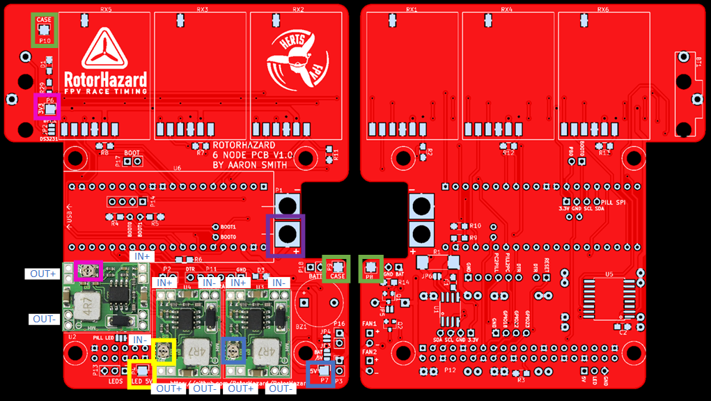
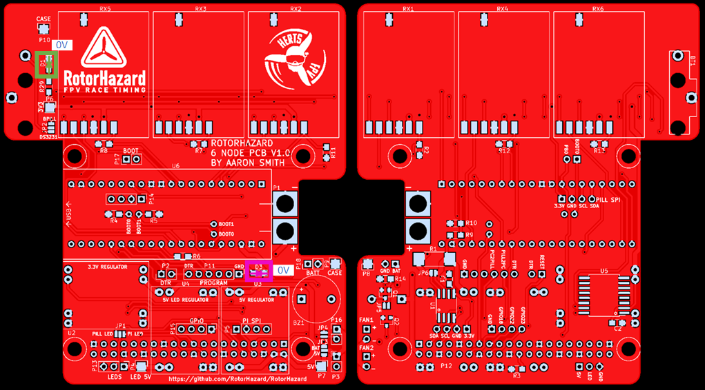
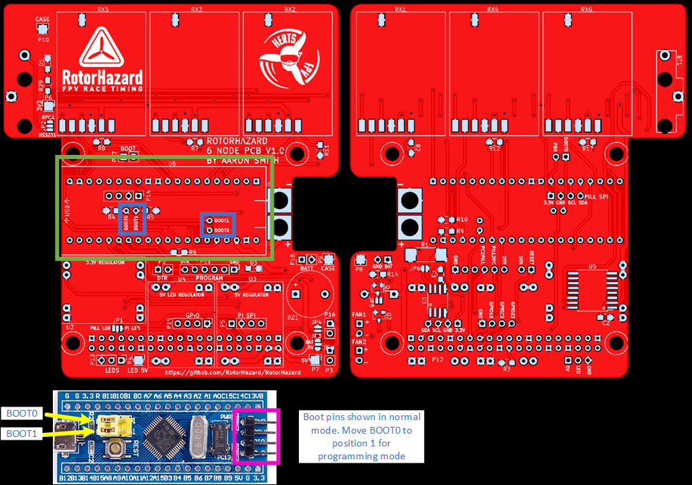
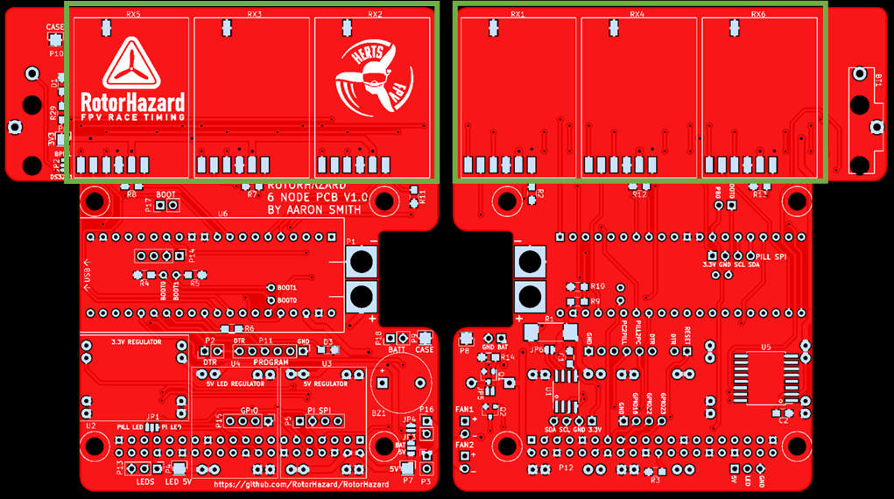
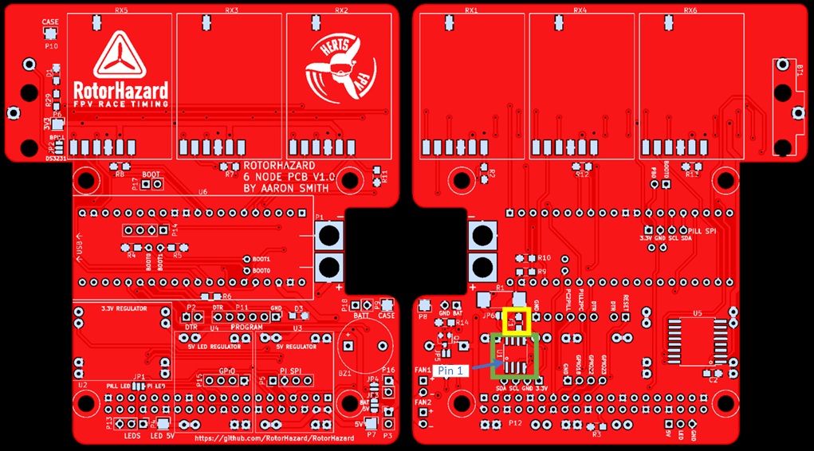
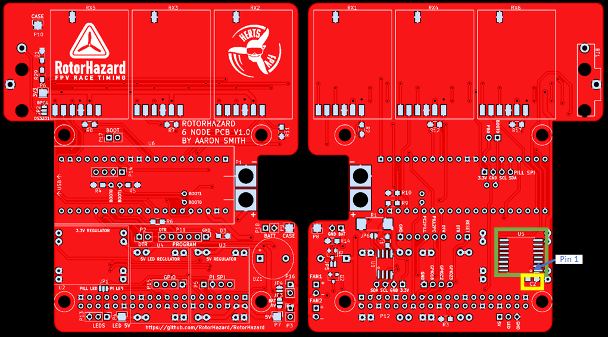
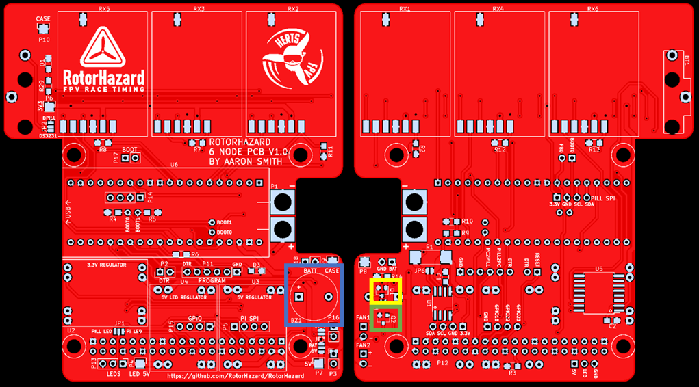
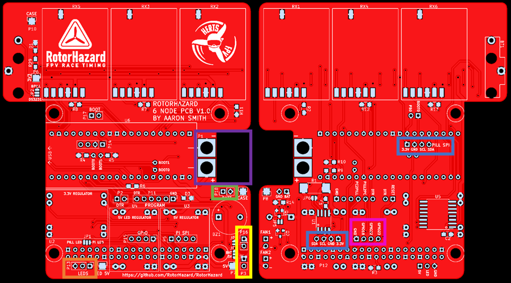

# RotorHazard 6 Node STM32 Build Instructions
There is a certain order that the board needs to be assembled as some parts are not accessible once others are fitted

Throughout the instructions there are colours in brackets in the text, these refer to the highlighted areas on the images

It is recommended that you setup the raspberry pi before building the lap timer, this enables you to test at various stages through the assembly process. Raspberry pi software setup instructions can be found [here](/doc/Software%20Setup.md)
## Step 1 - The jumpers & resistors
Select the jumper positions that you want on the board (Green):
* JP1 = Select if you want the Raspberry Pi or STM32 module to control the LED's
* JP2 = Select if the coin battery should power the DS3231 or STM32 module RTC
* JP3 = Select to power fans from Vbatt or 5V
* JP4 = If you want the fans on constantly bridge this
* JP5 = If you don't want to use a MOSFET on the buzzer bridge this
* JP6 = If you aren't using a current sense resistor bridge this

Fit the resistors
* 100k (Blue) = R2, R7, R8, R9, R11, R12, R13
* 10k  (Yellow) = R3, R4, R5, R10, R14
* 220r (OPTIONAL) (Orange) = R6, R29
* 0.1r (OPTIONAL) (Pink) = R1

## Step 2 - The raspberry pi header
Solder the raspberry pi header (P12) (Green) to the board. Solder one pin to start with and then make sure it is aligned straight before soldering the rest

The header should be fitted to the side of the board that doesn't have the RotorHazard logo on it as shown below.

 

## Step 3 - The regulators
Solder U4 (OPTIONAL), U2 & U3 with MP1584 modules using 2 pin 2.54mm pin headers, ensuring the correct orientation (see image below)

TIP: Only solder 1 pin from GND, IN+ and OUT+ for now, until you know they work

Solder a temporary connection to P1 that allows you to apply power (the XT60 needs to be soldered with the PCB in the case to ensure the correct alignment)

Using a Digital Multi Meter (DMM) verify the following resistances:
* P10 (negative probe, Green) to P1 + side (positive probe, Purple) > 1k ohm
* P10 (negative probe, Green) to P6 (positive probe, Pink) > 1k ohm
* P10 (negative probe, Green) to P7 (positive probe, Blue) > 1k ohm
* P10 (negative probe, Green) to P4 (positive probe, Yellow) > 1k ohm

Apply power to the board using the temporary connection to P1

Set the DMM to measure voltage

Using a small flat head screw driver 
* Set the voltage between P10 (negative probe, Green) and P6 (positive probe, Pink) to 3.5V - 3.6V using the potentiometer on the 3.3V regulator (U2) (Pink)
* Set the voltage between P10 (negative probe, Green) and P7 (positive probe, Blue) to 5.1 - 5.2V using the potentiometer on the 5V regulator (U3) (Blue)
* (Omit if U4 is not fitted) Set the voltage between P10 (negative probe, Green) and P4 (positive probe, Yellow) to 4.9V - 5.0V using the potentiometer on the 5V LED regulator (U4) (Yellow)

Once the correct voltages are set apply some hot glue over the potentiometers on U2-U4 to prevent the setting being changed by accident

TIP: If the WS2812B don't work when connected check you are connected to the DIN end of the rope / panel. Then try changing U4 to 4.5V - 4.6V

## Step 4 - The LED's (OPTIONAL)
If you are going to use the two LED's D1 (Green) and D3 (Pink) now is the time to solder them

Usually surface mount LED's have a green line on one end, this end should point to the 0V terminal
* For D1 the 0V terminal is the side closest to P10
* For D3 the 0V terminal is the side closest to P18

## Step 5 - The STM32 module (BPill)

It is recommended to fit the STM32 module directly to the board, but you may also wish to use headers so it can be removed. Using headers won't work with the current case design as the PCB will be too tall.

You can choose to connect the on board BOOT0 and BOOT1 pins to the STM32 pins which will mean you don't have to change the header pins to program for the first time. If you wish to use these you will need to solder wires to BOOT0 and BOO1 holes under U6 and then solder to the corresponding BOOT pins on the STM32 module. If you do solder the BOOT pins to the board remove the included headers!

It should be noted that the pins on the STM32 may be slightly bent and the hole tolerance on the board is quite small so it may a few minutes to align the holes correctly, be patient it will fit. A good technique is to start in one corner push the pins in from the other side and work up the board pushing the pins in. 

Once the STM32 is soldered, cut the STM32 module pins to the right length to prevent them shorting to something underneath.

It is recommended to cut off the 4 pins (Pink) that come off the STM32 module by the XT60 so you can solder the XT60 more easily. You won't need these pins unless you plan to do software development.

If you are using the on board jumper pins and not soldering BOOT0 and BOOT1 to the board then you should connect them in the following way
* For normal operation BOOT0 and BOOT1 both in position 0
* To program the firmware to the STM32 module for the first time BOOT0 = 1, BOOT1 = 0

Now is a good time to plug in the raspberry pi and check that everything boots up ok. It is recommended to re-do the resistance measurement with the DMM in Step 3 before applying power.

## Step 6 - The RX5808 modules
Now solder on the RX5808 modules (R1-R6) (Green)

Solder one pin and use it to align the others. Once aligned solder the remaining pins

NOTE: The unused pins are omitted from the PCB. This is to aid de-soldering should you need to do so in the future.

Now is a good time to plug in the raspberry pi and check that everything boots up ok. It is recommended to re-do the resistance measurement with the DMM in Step 3 before applying power.

## Step 7 - The INA219 (power, voltage & current sense) (OPTIONAL)
If you wish to solder the INA219 (Green) first ensure the correct alignment of the part. Pin 1 could be indicated by a line on the top edge or by a dot or hash next to pin 1

Make sure pin 1 of the INA219 is aligned to the small circle on the solder mask of the PCB.

Next solder one pin to the board and make sure all pins line up properly. Once aligned solder the pin in the opposite corner of the INA219

You can solder each pin individually but it is recommended to drag solder the pins in one go. The build video at the top will show this as will a number of YouTube tutorials on drag soldering.

TIP: Do yourself a favour and use a chisel tip on your soldering iron and decent quality solder. Especially if drag soldering.

TIP: Have some solder wick standing by in case you introduce a short

Once soldered check there are no shorts with a magnifier.

Lastly attach the 100nF capacitor to C1 (Yellow), you might get away with omitting this but the datasheet recommends it

## Step 8 - The DS3231 (Real Time Clock) (OPTIONAL)
If you wish to solder the DS3132 (Green) first ensure the correct alignment of the part. Pin 1 is indicated by a dot or hash symbol by pin 1 on the part

Make sure the pin 1 of the DS3231 is aligned to the small circle on the solder mask of the PCB.

Next solder one pin to the board and make sure all pins line up properly. Once aligned solder the pin in the opposite corner of the DS3231

You can solder each pin individually but it is recommended to drag solder the pins in one go. The build video at the top will show this as will a number of YouTube tutorials on drag soldering

TIP: Do yourself a favour and use a chisel tip on your soldering iron and decent quality solder. Especially if drag soldering.

TIP: Have some solder wick standing by in case you introduce a short

Once soldered check there are no shorts with a magnifier.

Attach the 100nF capacitor to C2 (Yellow), you might get away with omitting this but the datasheet recommends it

Attach the battery holder to BT1, do not fit the coin cell until the soldering is completed

## Step 9 - The left overs
If you wish to control the buzzer through a MOSFET which is recommended then fit Q1 (Yellow)

If you wish to fit the buzzer (BZ1) (Blue) then fit it now

If you wish for the raspberry pi to be able to control if the fans are enabled then solder Q2 (Green) to the board

## Step 10 - The Headers
The board contains a number of headers, most of which you don't need to fit

Unless you are doing something unusual you do not need to worry about soldering headers to P2, P11 or P17 at all

P3 and P16 (Yellow) are provided for fan connections, you could direct solder if you want or choose a suitable header

P18 (Green) is provided as a Vbatt connection to connect the voltage display to.

P5 and P14 (Blue) are provided for I2C interfaces. It's unlikely you will need these but they are included for future expandability

P15 (Pink) is spare GPIO pins to the pi, you may wish to use these for something like a shutdown button on the case.

P13 (Orange) is provided for the LED connector. 

Once you have a case, remove the temporary power wire from P1 (Purple) then fit the boards into the case and solder the XT60 in place whilst in the case to ensure it fits the hole correctly.

