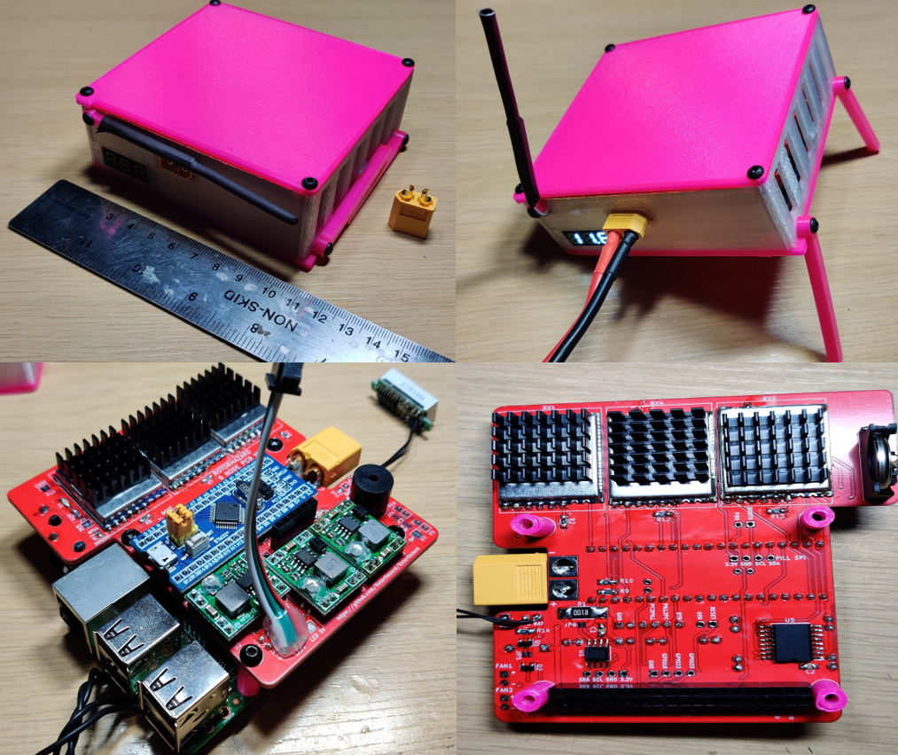
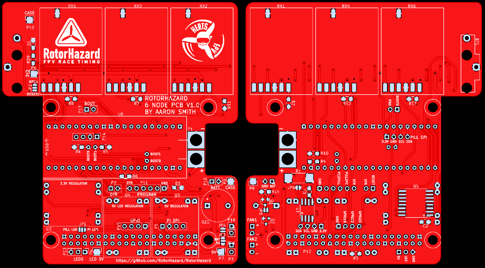

# RotorHazard 6 Node STM32 module

## Features

* Supports 1 to 6 RX5808 nodes
* Board size is 97mmx87mm, with cutouts for an XT60 & Raspberry Pi connectors
* The Raspberry Pi plugs directly into the PCB in a raspberry Pi 'hat' style, to keep things compact
* Instead of multiple Arduinos, the board uses a single STM32 processor on a 40 pin module, mounted on the PCB
* The STM32 firmware can be updated via the RotorHazard web GUI using the 'Update Nodes' button (in the 'System' section on the 'Settings' page)
* The same server and node source code supports both the 6 node STM32 and the (existing) multi-Arduino boards
* Supports power/battery monitoring and a buzzer (low-battery alarm)
* INA219 (Current sense IC) & DS3231 (Real Time Clock) + RTC battery can be mounted directly to the PCB
* Connector pads for LED-strips & dedicated regulator
* Fans can be automatically switched on based on raspberry pi temperature.

PCB build instructions can be found [here](BoardBuild.md)

PCB: 

## Cost
The cost of the required part is approximately £74 (~102.60 USD)

For each node add £6, so all 6 nodes would add £36 (~49.90 USD)

All the optional parts add approximately £23 (~31.90 USD)

To fit all parts to the board will cost approximately £133 (~184.40 USD)

Note: The above costs include the raspberry pi 3 + SD card, it may be possible to find the parts cheaper from other suppliers

## Bill of Materials (BOM)
The PDF version of the BOM can be found [here](RotorHazard_6_Node_Timer_BOM_V1.0.pdf), the PDF version contains more information and suggested parts / suppliers
### Required

For the PCB:
Reference                       | Quantity  | Part No.                                                           | Notes
--------------------------------|-----------|--------------------------------------------------------------------|---------
PCB                             |   1       | Download the [gerber files](RotorHazard_6_Node_Timer_fab_V1.0.zip) | Click [here](https://www.pcbway.com/project/shareproject/RotorHazard_6_Node_STM32_Lap_Timer.html) to buy from PCBway
P12	                            |   1	    | 2.54mm 20x2 8.51mm tall header                                     | Single strips also work
P1	                            |   1	    | XT60 Male	                                                         | -
R2, R7, R8, R9, R11, R12, R13	|   7	    | 100k ohm 5% 0805 resistor                                          | -
R3, R4, R5, R10, R14            |   5       | 10k ohm 5% 0805 resistor                                           | -
U2, U3                          |   2	    | MP1584	                                                         | -
U2, U3  	                    |   16	    | 2.54mm header pins                                                 | -
U6	                            |   1	    | STM32F103C8T6 	                                                 | -
RX1, RX2, RX3, RX4, RX5, RX6    |   1-6	    | RX5808	                                                         | 1 of these is required for each node you wish to fit

For the timer build:
Name                            | Quantity  | Notes
--------------------------------|-----------|---------
RASPBERRYPI_3B+                 |   1       | Alternative: Raspberry Pi 4
8GB+ Micro SD card              |   1       | Any Micro SD card between 8GB and 64GB will work
M3x8mm screw                    |   11      | Slightly longer screws would also work
M2.5x10mm countersunk screw     |   4       | M3 can be used if you widen the raspberry pi mounting holes with a drill, slightly longer screws would also work
  
You will also require some 3D printed parts for the case and the 11.5mm 3D printed stand offs. If you wish to use a different case then 12mm standoffs should work.
  
### Optional
For the PCB:
Reference                       | Quantity  | Part No.                      | Notes
--------------------------------|-----------|-------------------------------|---------
U5                              |	1	    | DS3231SN                      | Fit if you want the real time clock (RTC), alternatives: DS3231S#T&R, DS3231SN#, DS3231S#
BT1	                            |   1	    | Keystone Electronics 1069     | Fit if you want the real time clock (RTC)
BT1	                            |   1	    | CR1632 battery                | Fit if you want the real time clock (RTC), alternatives: CR1620, CR1616
R1	                            |   1	    | 0.1 ohm 2512 1% resistor      | Fit if you wish to use the current sense IC
U1	                            |   1	    | INA219AIDR	                | Fit if you wish to use the current sense IC, alternatives: INA219AID, INA219BID, INA219BIDR
C1, C2	                        |   2	    | 100nF X7R 0805 capacitor      | These are decoupling capacitors for INA219 and DS3231
D1, D3	                        |   2	    | 0805 LED       	            | Fit if you want the on-board power and status LED's, not really needed
R6, R29	                        |   2	    | 220 ohm 5% 0805 resistor	    | Fit if you want the on-board power and status LED's, not really needed
P4	                            |   1	    | 3 pin JST SM Female	        | Fit if you want to use RGB LED rope / tape
U4	                            |   8	    | 2.54mm header pins            | Fit if you want to use RGB LED rope / tape
U4	                            |   1	    | MP1584	                    | Fit if you want to use RGB LED rope / tape
BZ1	                            |   1       | 12mm x 9.5mm 5V buzzer        | Used for low voltage alarm
Q1, Q2	                        |   2	    | GSD SOT-23 N-Channel MOSFET   | 1 is used for optional switched buzzer, the other is used for optional fan enable control, an example is IRLML6344TRPBF

For the Timer Build:
Reference                       | Quantity      | Notes
--------------------------------|---------------|---------
Raspberry Pi heat syncs         |   1 set       | Recommended to keep the pi cool
20x20x6mm heat sync             |   1-6         | Recommended to keep the RX5808's cool
Thermal glue                    |   1 tube      | Needed to attach the RX5808 heat syncs
LCD Voltage Screen              |   1           | Used to show the battery voltage on the case
M2x5mm screw                    |   2           | Used to screw the LCD voltage screen to the case
Heat shrink                     |   90mm        | Used to attached wifi antenna to the arm, if you are using a modified wifi USB module 
Wire                            |   As required | Wire may be needed to attach the Voltage monitor and to ground the case to the PCB

## Tools
### Required
1. Soldering iron (chisel tip recommended to fit INA219 or DS3231 IC's)
2. Solder
3. Tweezers
4. Digital Multi Meter (DMM), to measure voltage and resistance
5. Screw driver for screws purchased
6. Small flat head screw driver to adjust MP1584 voltage

### Recommended
1. Wire cutters / side cutters
2. Helping hands
3. Solder wick
4. Hot glue & glue gun
5. Pilers
6. Insulation tape
7. Copper tape with conductive adhesive

## Resources

[RotorHazard 6 Node STM32 module Schematic](RotorHazard_6_Node_Timer_V1.0.pdf)

[Gerber files for RotorHazard 6 Node STM32 module PCB](RotorHazard_6_Node_Timer_fab_V1.0.zip)

[RotorHazard 6 node STM32 module Board Build Guide](BoardBuild.md)

[RotorHazard 6 node STM32 module Board Build Video]()