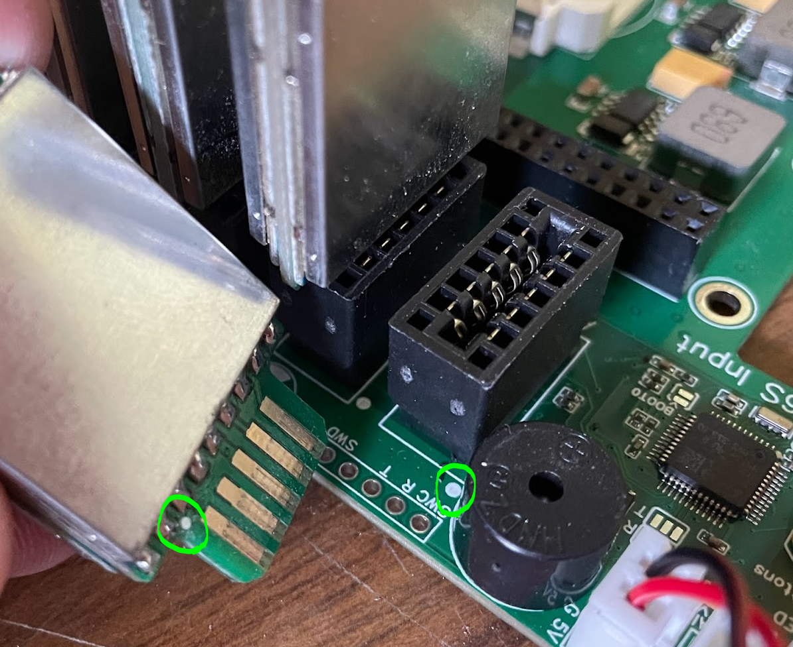
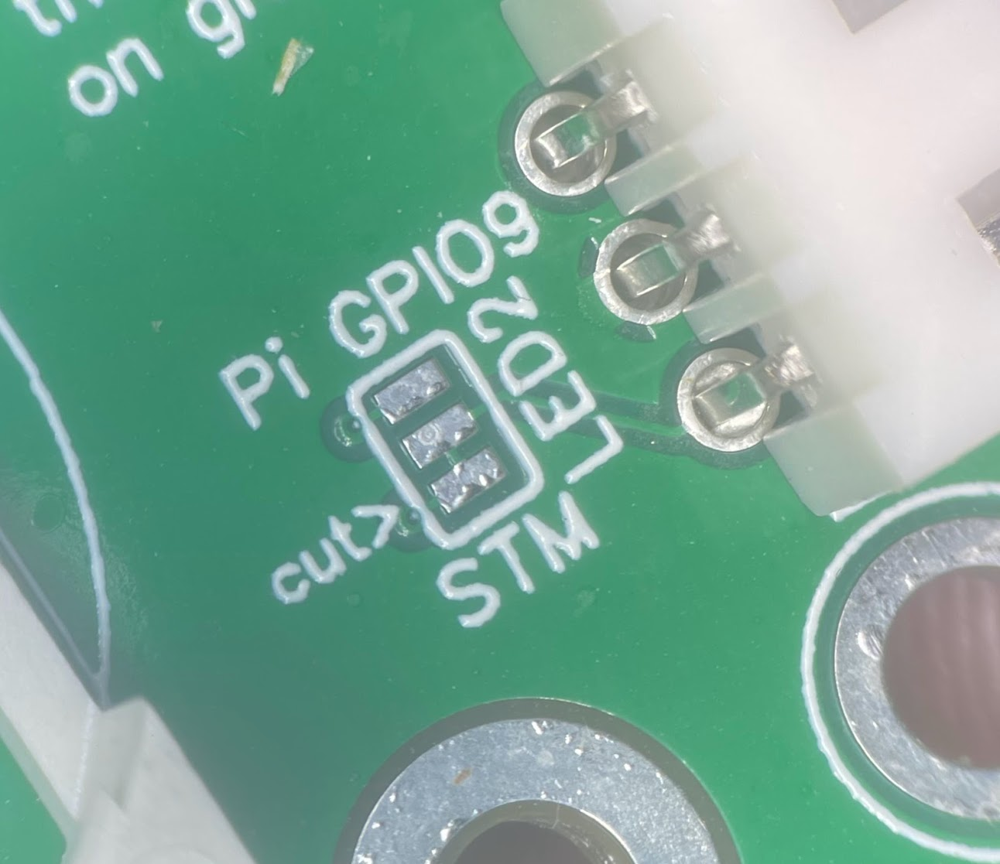

# NuclearHazard Timer

The NuclearHazard by NuclearQuads represents the next generation of RotorHazard timer hardware.

[Buy timers here!](https://www.etsy.com/listing/1428199972/nuclearhazard-rotorhazard-timer)

## Features

Instead of a PCB with many additional modules, this board uses the bare components to maintain compatibility while being **fully assembled** by the PCB manufacturer.

This uses the same STM32 chip as the BluePill board, but built right into the main board. Updating the STM32 is easily done through the web interface.

The RX modules are soldered to dual-RX carrier boards, which slot in to connectors on the main board for easy upgrades.

Fits all **Model A, B, and Zero** Raspberry Pis.

Power, fan, and LED connectors are all included on the main board.

2-5S power input (21V recommended max). **NOTE: V3 boards incorrectly say 2-6S but 6S can damage the regulator.**

RTC battery is connected to the STM32's RTC battery pin, but **the software does not support this method of RTC yet.**

VBAT is sensed by the STM32 but **the software does not support the Pi monitoring from this yet.**

## Assembly

Before installing the Pi onto the board, install the board in the case and secure with 2-4 screws. Use 4-6mm M3 screws.

When installing the Pi onto the board, line up the 40-pin connector and press both sides evenly.

You could use [11mm standoffs](https://www.adafruit.com/product/2336) between the timer board and the Pi, but they are not needed.

The RX module cards can carry 1 or 2 RX5808s. The RotorHazard software will sense (on boot) which solts are filled and work with any number of modules in any slots on the board. Just make sure the cards are inserted correctly (with the dots lined up). 

If the card is inserted the wrong way, the timer will not be able to set the VRX channel and you'll have bad readings. When adding an RX to a card, be careful to not get solder on the gold plated edge connectors.

If you order a timer from me, I will have the latest node code with the buzzer fix uploaded to the STM32 already. Otherwise the STM32 will need to be flashed after installing the Pi and software. To do so, power the board and use the RH web flashing interface. This board uses a slightly different beeper that needs a line of the node code changed to work. The .bin in the node_src folder has this change. There is also a direct connection for a FTDI adapter to the STM32 to program without the Pi.

## Extra Info

### Voltage regulation

If adding many 5V accessories (LEDs, Fans) try to be concious of the power draw. The 5V regulator on this board is rated for 3A and is already running the Pi and the Fan outputs.

The 3.3V rail is used for the STM, VRXs, and various other little things.

### LED plugs

There are two plugs for connecting LEDs. The one labeled **LED1 is the main one that should be used.** It's connected to the Pi's **GPIO10** by default and uses a JST-XH connector (the same as a 2S balance connector).

The LED2 plug is connected to the STM32's PA15 by default. Currently there is no code to support LED output from the STM, but it could be added. If for some reason you need to use a different GPIO output on the Pi for an LED strip, the LED2 plug can be switched to the Pi's GPIO18 (V3 PCB is misprinted with GPIO9) with the solder jumper (read next paragraph). Make sure to change the software configuration to match. Currently using GPIO18 from the Pi with this board doesn't work. Constant beeping and weird software behavior is observed in this configuration. Let us know if you find a solution.

There are solder jumpers on the PCBs to switch the LED signal pins. For each plug there is a small trace between two of the pads to enable the default connection. If you want to change from the default connection, you'll have to cut the trace between the jumper pads, then add a solder blob from the middle pad to ONE of the outer pins. After making changes to the jumpers but before powering it up, use a multimeter to ensure only one of the outer pads have continuity to the middle pad.

### Fan connectors

The fan connectors are JST-XH and supply 5V any time the Pi is commanding them on. To bypass the Pi control, solder the jumper and it'll always supply 5V. There are polarity markings next to the connectors. Make sure your fan matches these. The picture on **the amazon listing for the fans I bought showed the wrong polarity**. If needed, repin the fan connector.

### Power connectors

I have no recommendations for power buttons since I just pull the power or use software to shut down, but there is a 2.54mm pitch header with the power button and LED connections marked on the board. Feel free to add recommendations here if desired.

### Ground pad for shielding

I'm not experienced with shielding, but if needed, there is a ground pad near the RXs that could be used to connect shielding to the board's reference.

## Future Provisions

This board has some hardware features that don't have software support yet, but hopefully will some day. **Don't buy a product based on unimplemented features.**

### ESP32

There is a footprint for a ESP32-WROOM-32UE module. This is currently unused and unpopulated, but it's connected per the schematic. This could be used for ELRS or some other kind of integration in the future but don't count on it.

### RTC

There is a battery connector that powers the STM32's RTC. Currently this does nothing. With some software help, this could enable the Pi to boot with the proper time without an internet connection.

### Battery voltage monitoring

There is a voltage divider on the board going from the main power supply to an ADC on the STM32. This would be very nice to have reported to the Pi and displayed on the web interface with an audible alert when it gets below a set threshold.

## Case

To download the most up-to-date 3D model, open the [Onshape project](https://cad.onshape.com/documents/c21f8ac03c166bed0d6faeab/w/4bf3b280307091cb20025cb6/e/e612456715c51f2099caf754?renderMode=0&uiState=6442fc1c72ca37077803aba0) right click the NuclearHazard tab at the bottom, choose export, select STL format, check "Export unique parts as individual files", and click Export.

There are two versions of the lid- one for a 40mm fan and one for a 50mm fan.

Print the case with support for only the pi/power hole, sd card cutout, and led headers. Make sure there is no other unnecessary support.

## Problems

Can't flash STM32: make sure you enabled UART and [changed config.txt](https://github.com/RotorHazard/RotorHazard/blob/main/doc/Software%20Setup.md#3-apply-changes-to-bootconfigtxt)

## Schematic

[Schematic](https://github.com/SpencerGraffunder/RotorHazard/blob/NuclearHazardHardware/resources/NuclearHazard/pcb/img/Schematic_NuclearHazard.pdf)

## Ordering the PCB

Only order yourself if you're already familiar with the process or are going to put in effort to learn. To order this design straight from the factory yourself, follow these instructions.

1. Sign in to [jlcpcb.com](jlcpcb.com)
2. Click "Order Now" on the homepage
3. Upload the NuclearHazard_Gerber.zip file
4. Select your quantity
5. Make sure "PCB Thickness" is "1.6mm"
6. Select "Specify a location" for "Remove Order Number"
7. Enable PCB Assembly
8. Select "Added by Customer" for "Tooling Holes"
9. Verify settings are similar to this screenshot

10. Click "confirm" at the bottom
11. On the PCB tab just click NEXT
12. On the Bill of Materials tab, upload the BOM and Pick and Place (CPL) files
13. If a part is missing on the BOM list, click search and look for the part number (starts with a C) in the actual BOM file

14. Click NEXT on the component placements tab
15. Select your favorite product description on the right side
16. Click SAVE TO CART

17. Go back to the "Order Now" page and upload the NuclearHazardRXConnector_Gerber.zip file
18. Repeat 4-6
19. Select "ENIG" for "Surface Finish"
20. Select "Yes" for "Gold Fingers"
21. Make sure PCB Assembly is disabled
22. Add to cart
