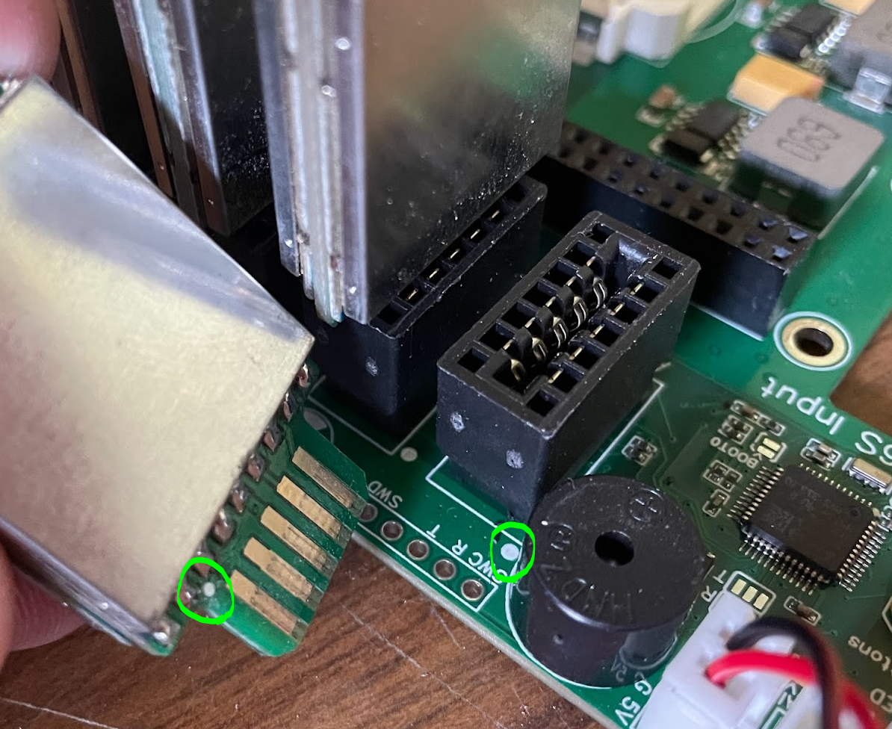
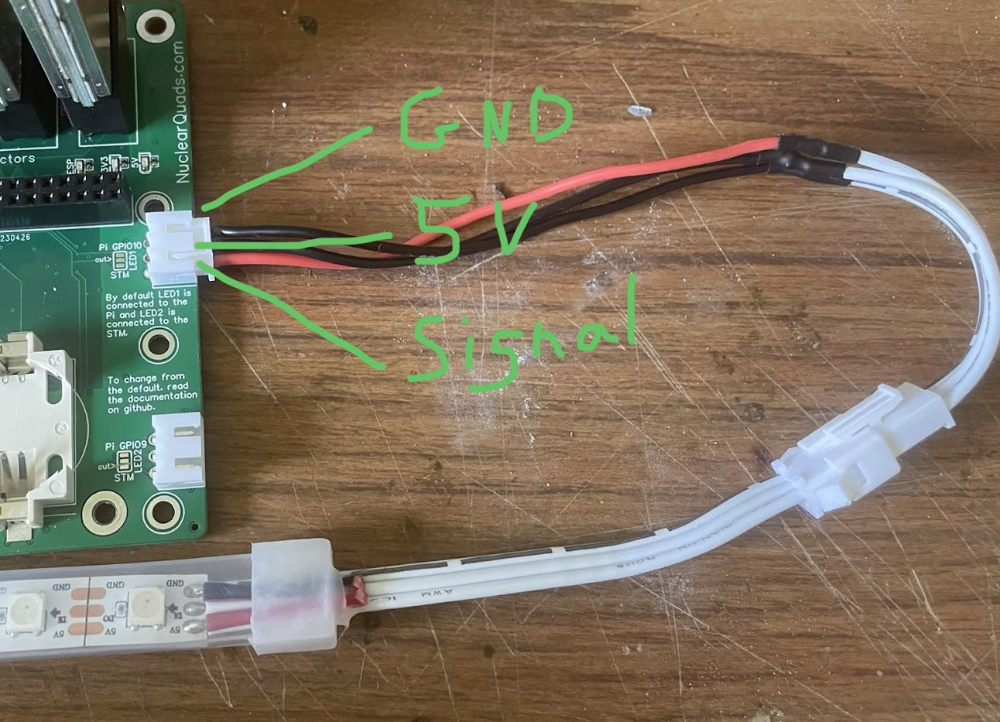
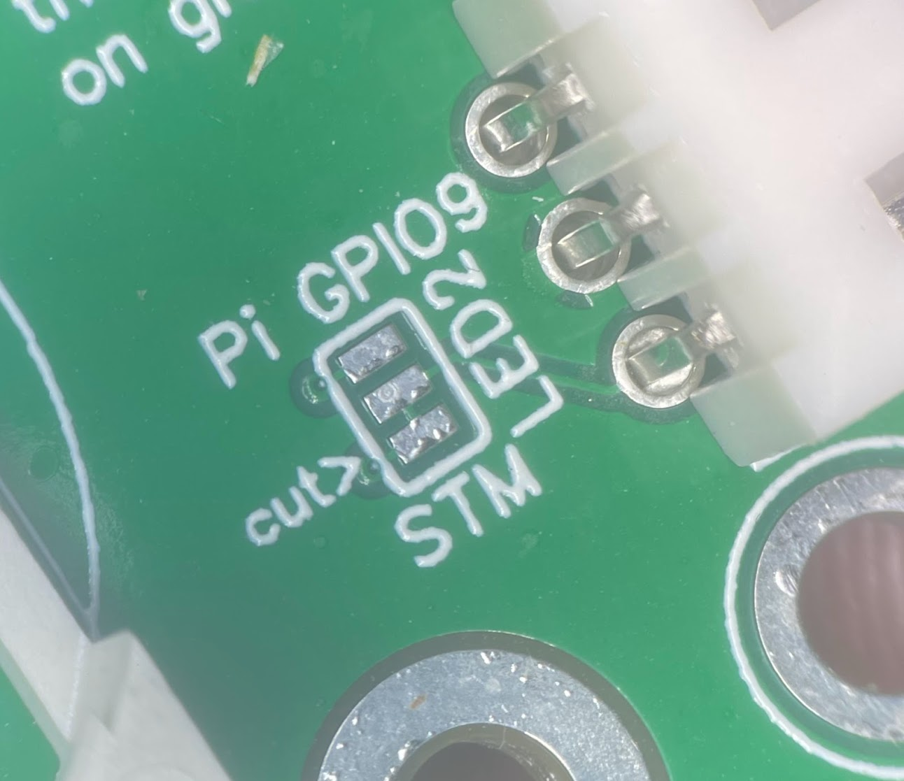
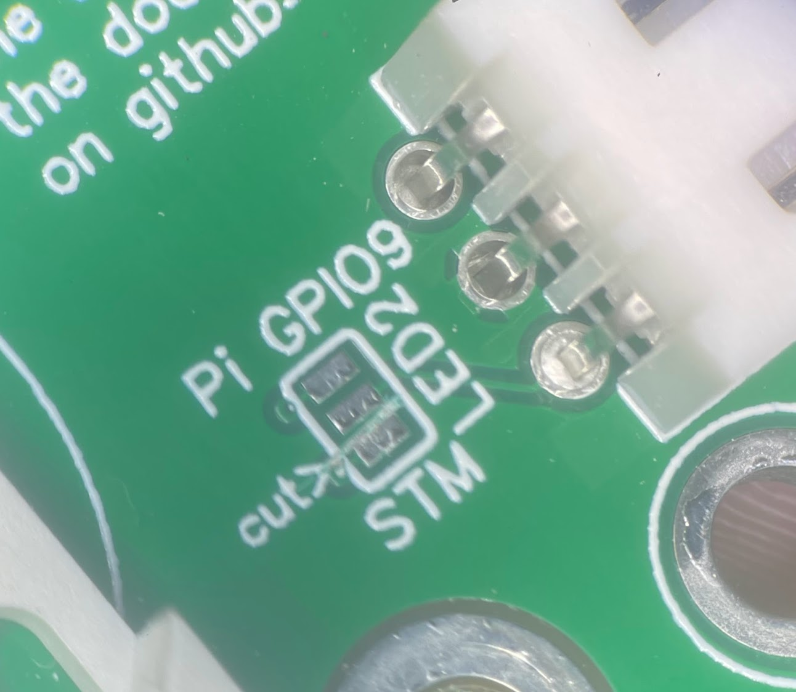
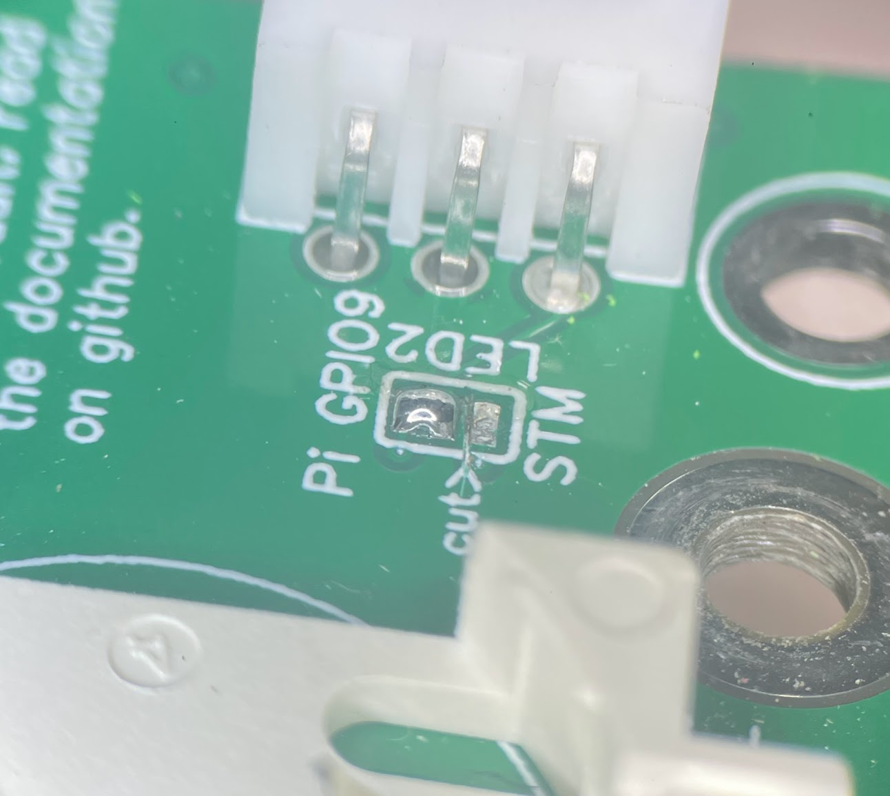
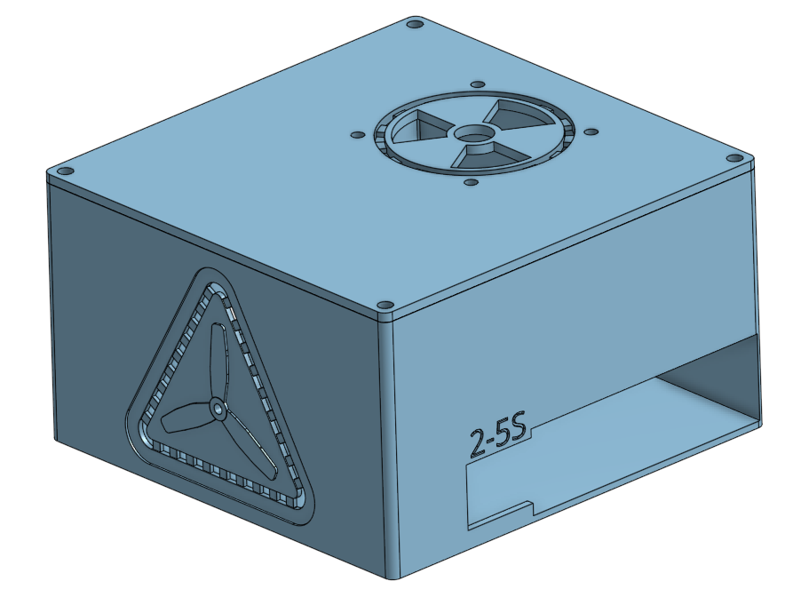
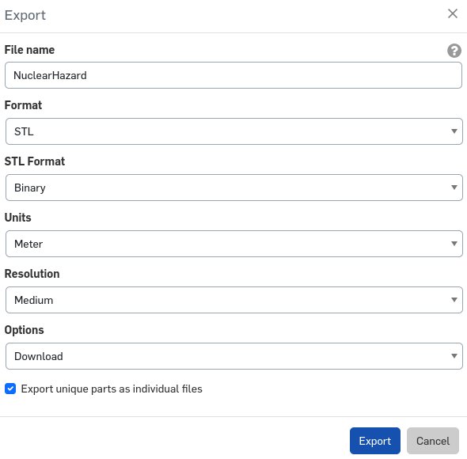
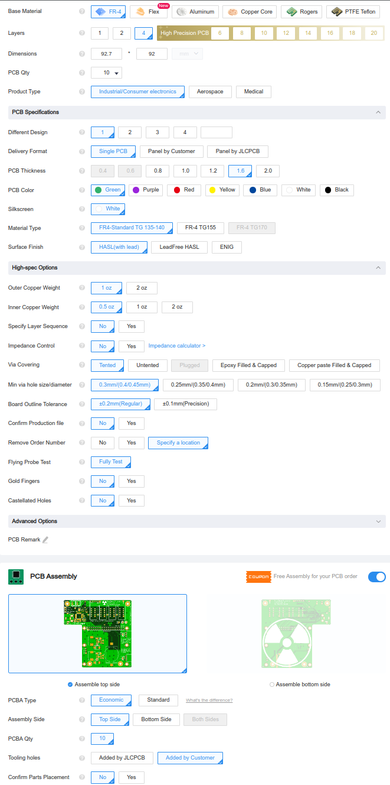
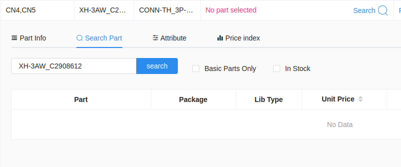

# NuclearHazard Core Timer

NuclearHazard Core is a design which allows simple access to RotorHazard timer hardware by allowing it to be populated directly by PCB manufacturers.

[NuclearHazard timer kits are available for purchase](https://nuclearquads.etsy.com/listing/1428199972) from the board designer.

## Features

Instead of a PCB the must be populated with many additional modules, this board uses the bare components to maintain compatibility while being fully assembled by the PCB manufacturer.

- The same STM32 chip as the BluePill board is attached directly to the main NuclearHazard board. Updating the STM32 is easily done through the web interface.
- RX modules are soldered to dual-RX carrier boards, which slot in to connectors on the main board for easy upgrades.
- Fits all **Model A, B, and Zero** Raspberry Pis.
- Power, fan, and LED connectors are included on the main board.
- 2–5S power input (21V recommended max).
- Hardware support for STM32-based RTC (see [Future Provisions](#future-provisions))
- Hardware support for STM32-based VBAT monitoring (see [Future Provisions](#future-provisions))

## Assembly

Before installing the Pi onto the board, install the board in the case and secure with 2–4 screws. Use 4–6mm M3 screws.

When installing the Pi onto the board, line up the 40-pin connector and press both sides evenly. You may use [11mm standoffs](https://www.adafruit.com/product/2336) between the timer board and the Pi, but they are not needed.

The RX module cards can carry 1 or 2 RX5808s. The RotorHazard software will sense (on boot) which solts are filled and work with any number of modules in any slots on the board. Just make sure the cards are inserted correctly (with the dots lined up). 

If the card is inserted the wrong way, the timer will not be able to set the VRX channel and you'll have bad readings. When adding an RX to a card, be careful to not get solder on the gold plated edge connectors.

The STM32 will need to be flashed after installing the Pi and software. To do so, power the board and use the RH web flashing interface. This board uses a slightly different beeper that needs a line of the node code changed to work. The .bin in the node_src folder has this change. There is also a direct connection for a FTDI adapter to the STM32 to program without the Pi. *If you order a timer from the designer, the latest node code with the buzzer fix will already be uploaded to the STM32.*

## Extra Info

### Voltage regulation

If adding many 5V accessories (LEDs, Fans) try to be concious of the power draw. The 5V regulator on this board is rated for 3A and is already running the Pi and the Fan outputs.

The 3.3V rail is used for the STM, VRXs, and various support components.

### LED plugs

The LED plug is connected to the Pi's **GPIO10** by default and uses a JST-XH connector (the same as a 2S balance connector).

There are solder jumpers on the PCBs to switch the LED signal pins. For each plug there is a small trace between two of the pads to enable the default connection. If you want to change from the default connection, you'll have to cut the trace between the jumper pads, then add a solder blob from the middle pad to ONE of the outer pins. After making changes to the jumpers but before powering it up, use a multimeter to ensure only one of the outer pads have continuity to the middle pad.

### Fan connector

The fan connector is a JST-XH and supply 5V any time the Pi is commanding it on. To bypass the Pi control, solder the jumper and it'll always supply 5V. There are polarity markings next to the connector. Make sure your fan matches these. **Pictures on amazon listings for fans should not be trusted.** If needed, repin the fan connector.

### Power connectors

There is a 2.54mm pitch header with the power switch and LED connections marked on the board where a power switch can be added. Use a toggle-type button or switch.

### Ground pad for shielding

There is a ground pad near the RXs that can be used to connect shielding to the board's reference/ground.

## Future Provisions

This board has some hardware features that don't have software support yet. Support may or may not be developed.

### ESP32

There is a footprint for a ESP32-WROOM-32UE module which is connected per the schematic.

### RTC

There is a battery connector that powers the STM32's RTC. Software changes could enable the Pi to boot with the proper time without an internet connection.

### Battery voltage monitoring

There is a voltage divider on the board going from the main power supply to an ADC on the STM32. Software changes could allow this to be reported to the Pi and RotorHazard sensor interface.

## Case

To download the most up-to-date 3D model:
1 open the [Onshape project](https://cad.onshape.com/documents/c21f8ac03c166bed0d6faeab/w/4bf3b280307091cb20025cb6/e/3b397b4fdfda612f6dfa1d79) 
2. right click the NuclearHazard tab at the bottom
3. choose export
4. select STL format
5. check "Export unique parts as individual files"
6. click Export

There are two versions of the lid: one for a 40mm fan and one for a 50mm fan.

Print the case with support for only the pi/power hole, sd card cutout, and led headers. Make sure there is no other unnecessary support.

## Troubleshooting

**Can't flash STM32**: Make sure UART is enabled and [config.txt](https://github.com/RotorHazard/RotorHazard/blob/main/doc/Software%20Setup.md#3-apply-changes-to-bootconfigtxt) is set up.

**RXs won't change channel**: An early batch of RX carrier cards misprinted the alignment dot. Try inserting the carrier cards backwards.

## Schematic

[Schematic](https://github.com/SpencerGraffunder/RotorHazard/blob/NuclearHazardHardware/resources/NuclearHazard/pcb/img/Schematic_NuclearHazard.pdf)

## Ordering the PCB

You may order the design files direct from JLCPCB, though it is an involved and technical process.

1. Sign in to [jlcpcb.com](jlcpcb.com)
2. Click "Order Now" on the homepage
3. Upload the NuclearHazard_Gerber.zip file
4. Select your quantity
5. Make sure "PCB Thickness" is "1.6mm"
6. Select "Specify a location" for "Remove Order Number"
7. Enable PCB Assembly
8. Select "Added by Customer" for "Tooling Holes"
9. Verify settings are similar to this screenshot

10. Click "confirm" at the bottom
11. On the PCB tab just click NEXT
12. On the Bill of Materials tab, upload the BOM and Pick and Place (CPL) files
13. If a part is missing on the BOM list, click search and look for the part number (starts with a C) in the actual BOM file

14. Click NEXT on the component placements tab
15. Select your favorite product description on the right side
16. Click SAVE TO CART
17. Go back to the "Order Now" page and upload the NuclearHazardRXConnector_Gerber.zip file
18. Repeat 4–6
19. Select "ENIG" for "Surface Finish"
20. Select "Yes" for "Gold Fingers"
21. Make sure PCB Assembly is disabled
22. Add to cart
