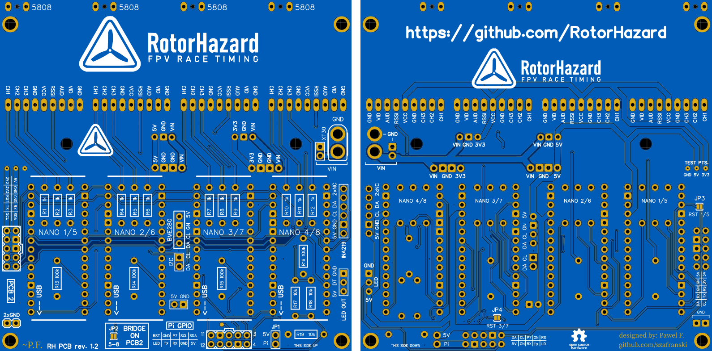

# RotorHazard PCB

The RotorHazard PCB 1.2 implements current hardware standards to simplify wiring and component placement, expediting timer builds and improving usability.

Download the [gerber file](Gerber_PCB%20RotorHazard%20PCB%20rev.%201.2.zip) to produce a board or send to a PCB manufacturer. Manufacturers often require bulk purchases, so check with other RotorHazard users near you before purchasing in case there is stock available or to split the cost of an order.

[View Board Schematic (PDF)](Schematic_RotorHazard-PCB-1_2_RC_2020-08-20_19-56-33.pdf)

## Features

* 100×100mm (matches common Delta5 V2 PCB)
* Functions as 1–4 node primary board or 1–4 node extension
* Implements hardware-based node address selection. Nodes do not need uniquely addressed and can remain st to address 0 on upload.
* Implements in-system programming wiring for "OTA" updates without removing Arduinos from board
* Integrated voltage converter for ISP line
* Supports standardized 2×5 pin ribbon cable connectors to Pi GPIO and between boards
* Dedicated connectors for BME280 and INA219 sensors
* Expansion connectors for other I2C devices
* Raspberry Pi power isolation jumper
* Additional VIN connector (common uses: case fan or diode for reverse voltage protection)
* Additional ground connectors (common use: case shielding)
* 6 screw-mount holes, 4 with exposed ground plane

## Testing

RotorHazrad does not manufacture PCBs and cannot guarantee the quality of any manufacturer. Thoroughly test any boards before connecting sensitive components.

## Assembly

This layout can be used as a primary board for up to 4 nodes when directly connected to the Pi, or a secondary board for up to 4 additional nodes. When connected directly it will be referred to as PCB1. If you are using only one board, follow all instructions for PCB1. A secondary board is referred to as PCB2.

* Find "THIS SIDE UP" indicator. This is the expected side on which to attach your components. While other configurations are possible, you will need to adjust these assembly instructions accordingly.
* Use node slots in numeric order. While RotorHazard should function with nodes placed out of order, in-system node flashing may not.
* Solder four resistors at "R" positions within each node area for all nodes you will be using. Use the values indicated (1k or 100k).
* R17-19 are required on PCB1. They are not used for PCB2.
* Female 0.1" (2.54mm) headers are expected for Arduino mounts, voltage regulators, and RX5808 mounts. Add these headers now if you are using them. If you choose to flush mount instead with resistors on the back, be sure to electrically isolate each component from the board.
* Bridge JP1 on PCB1. A physical jumper is recommended in this position. Bridging on PCB2 is not required.
* If using 5–8 nodes, connect "PCB2" headers between each board, being careful to match polarity. You may use a standard 2×5 pin ribbon cable or wire these insidivdually. On PCB2, bridge pads at the bottom marked "BRIDGE ON PCB2" (JP2)
* If using an odd number of nodes, bridge one and only one pad on the back of one board that corresponds to the highest numbered node in use:
1 node: PCB1 JP3
3 nodes: PCB1 JP4
5 nodes: PCB2 JP3
7 nodes: PCB2 JP4
* Connect a 5V voltage regulator and a 3.3V regulator on PCB1. Use either the upper (3) or lower (4) set of pins depending on the chosen regulator's pinout. Do not use both upper and lower sets at once for the same voltage.
* Connect input voltage connector or wires at VIN. Use XT30 connector if desired.
* STOP. Perform continuity testing to ensure there are no shorts from power to ground. Connect power at VIN and test 5V, 3.3V, and GND at test points on back of board before proceeding. Use a fuse or "smoke stopper" during these tests.
* Connect the Pi to the "Pi GPIO" header block. You may use a 2×5 pin cable attached to pins 3–12 of the Pi GPIO, or individual wires if you wish to change any connections (such as for "LED IN")
* If using INA219 or BME280 sensors, connect to dedicated pads.
* Connect Arduinos. Keep Aruino reset button and LEDs visible. Keep USB connector toward side indicated with "<-- USB" (away from voltage regulators).
* Connect RX5808 modules. Optionally connect GND pads near antenna. Do not solder to RX5808 antenna connection (center pad).
* When connecting an LED strip to LED OUT, ensure the voltage regulator you are using is rated highly enough for all arduinos, sensors, and the LED strip combined. If not, supply 5V for the LEDs from a separate regulator. You may still use the data and ground pads.

## Usage

* Before ISP flashing of nodes is possible, nodes must not be transmitting over serial. You can flash the most recent node version from RotorHazard, or the standard "Blink" sketch. (Delta5 and older RotorHazard node versions generally use serial and will prevent ISP from functioning.)
* Nodes should all be flashed with the node number of 0 (default). This board will automatically assign node numbers based on their position.
* In-system flashing can be accomplished with the [OTA tool](https://github.com/szafranski/RH-ota)
* If flashing nodes by USB, disconnect JP1 to prevent powering on the Pi.

## Credit

This board and the OTA tool were developed by [Paweł Fabiszewski](mailto:p.fabiszewski@gmail.com).
