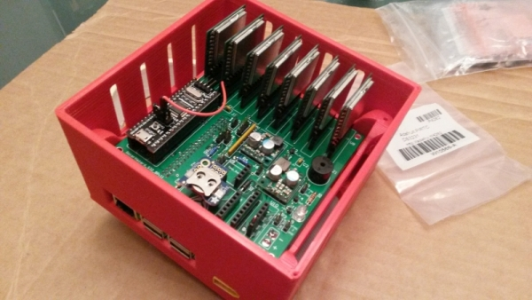
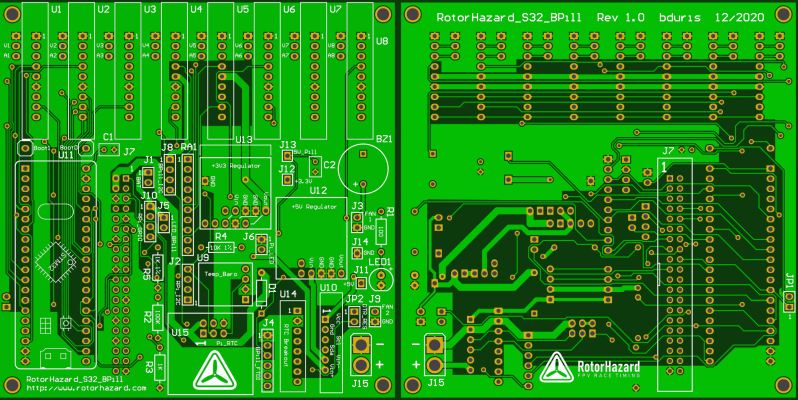
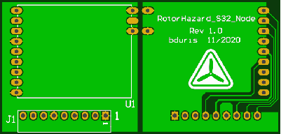
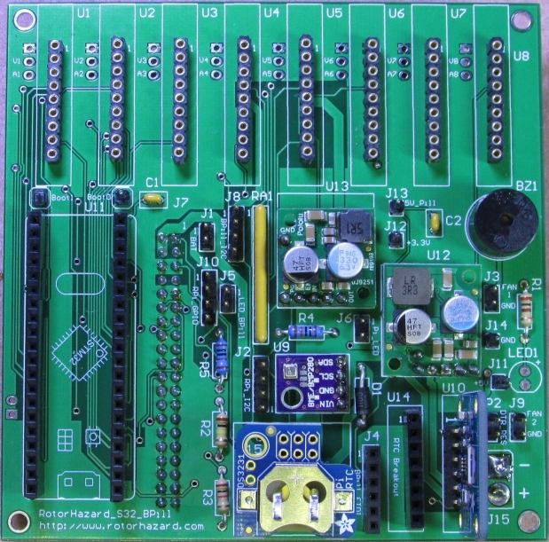

# RotorHazard S32_BPill PCB

The RotorHazard S32_BPill PCB v1.0 represents the next generation of race-timer hardware.

## Features

* Instead of multiple Arduinos, the board has a single STM32 processor

* Board size (100x100mm) is the same as the "standard" Delta5 PCBs

* Supports 1 to 8 RX5808 node modules on a single PCB

* The RX5808 node modules are mounted vertically using small sub-boards -- this allows for up to eight on a single board, and provides substantially improved cooling

* Communication between the STM32 processor and the Raspberry Pi is via serial-port link, running at 921600 baud. The S32_BPill board can also be connected directly to a computer (via USB-to-Serial/FTDI dongle)

* The STM32 processor is on a 40-pin module, attached to the board via sockets. These are commonly known as "Blue Pill" modules, and are readily available and inexpensive (see [below](#aboutblue))

* The board has a 40-pin (2x20) header for connecting to the Raspberry Pi, via a [ribbon cable](https://www.ebay.com/itm/40-Pin-2x20-Female-to-Female-2-54mm-Pitch-40-wire-IDC-Flat-Ribbon-Cable/391776118674) with female ends

* The STM32 processor is in-circuit programmable, able to be updated/flashed using the Raspberry Pi. The update can be performed via the RotorHazard web GUI using the 'Update Nodes' button (in the 'System' section on the 'Settings' page)

* The same server and node source code supports both the S32_BPill and the (existing) multi-Arduino boards

* Supports power/battery monitoring and a buzzer (low-battery alarm)

* Mounting locations for (optional) [DS3231](#rtc) (RTC), [INA219](https://www.adafruit.com/product/904) and [BME280](https://www.amazon.com/Onyehn-Temperature-Humidity-Barometric-Pressure/dp/B07KR24P6P) modules, connected to the Raspberry Pi I2C bus

* Optional "extra" LED, which can be panel mounted on the timer case

* Connector pads for LED-strips: J6 "Pi_LED" (near the middle of the board); pin 1 is ground, pin 2 is signal (going to GPIO10 on the Raspberry Pi)
 

Main PCB: 
  
Node PCB: 

## Resources

[RotorHazard S32_BPill PCB Schematic](files/RotorHazard_S32_BPill_SCH_R1.pdf)

[RotorHazard S32_BPill Node-board Schematic](files/RotorHazard_S32_Node_SCH_R1_0.pdf)

[Gerber files for RotorHazard S32_BPill PCB](http://www.rotorhazard.com/files/GerberFiles_RotorHazard_S32_BPill_R1.zip) &nbsp; (alternate link: [on GitHub](files/GerberFiles_RotorHazard_S32_BPill_R1.zip))

[Gerber files for RotorHazard S32_BPill Node board](http://www.rotorhazard.com/files/GerberFiles_RotorHazard_S32_Node_R1_0.zip) &nbsp; (alternate link: [on GitHub](files/GerberFiles_RotorHazard_S32_Node_R1_0.zip))

The Gerber files can be sent to a PCB manufacturer to fabricate boards. To build a timer, you will need one S32_BPill PCB, and several of the S32_BPill Node boards (one for each RX5808 module in the timer).

The size of the node board is 34.3x33.0mm, with a recommended thickness of 0.8mm (for better thermal conductivity and more capacitance between layers). The recommended thickness for the main PCB is the standard 1.6mm, and, in general, the default PCB-fabrication settings should work well (i.e., 1oz copper, HASL finish, no castellated holes, no gold).

Bill of Materials: [PDF](files/RotorHazard_S32_BPill_R1_bd02.pdf) | [XLS](files/RotorHazard_S32_BPill_R1_bd02.xls) | [HTML](http://www.rotorhazard.com/files/RotorHazard_S32_BPill_R1_bd02.html)

[RotorHazard S32_BPill Main Board Build Guide](mainBoardBuild.md)

[RotorHazard S32_BPill Node Board Assembly](nodeAssembly.md)

[Altium 16.1 project files exported to ASCII](https://github.com/RotorHazard/rhfiles/raw/main/S32_BPill/files/RotorHazard_S32_BPill_R1_AltiumAscii.zip)

[CAD drawings of S32_BPill PCB](https://github.com/RotorHazard/rhfiles/raw/main/S32_BPill/files/RotorHazard_S32_BPill_PCB_R1.pdf)

[CAD drawings of S32_BPill Node Board](https://github.com/RotorHazard/rhfiles/raw/main/S32_BPill/files/RotorHazard_S32_Node_PCB_R1_0.pdf)

[PCB Build Notes](files/Build_notes.txt) and [Pin Soldering Helper](files/PinSolderingHelper.pdf) doc

[Socket Headers](headers.md) and [Trimming Jig](trimjig.md) for RotorHazard S32_BPill

[Generic Blue Pill Pinout](files/GenericBluePillPinout.jpg)

[RobotDyn "Black" Pill Pinout](files/STM32F103C8T6-RobotDyn_Black_Pill_pinout.pdf)

## Notes

* For the S32_BPill board the RotorHazard server must be version 3.1.0 or later.

* The recommended voltage regulators for the board are Pololu [D36V28F5](https://www.pololu.com/product/3782) (5V) and Pololu [D24V22F3](https://www.pololu.com/product/2857) (3.3V). See [here for additional notes](files/PololuCompatibilityWithRaceTimer.txt) about Pololu voltage regulators.

* The board supports two types of [Real-Time Clock](../../doc/Real%20Time%20Clock.md) (RTC) modules - '[DS3231 PiRTC](https://www.adafruit.com/product/4282)' (3x2 header U15) and '[DS3231 Breakout](https://www.adafruit.com/product/3013)' (8-pin header U14). Only one should be attached at a time. See the '[doc/Real Time Clock.md](../../doc/Real%20Time%20Clock.md)' file for setup instructions.

* The recommended installation option for the RX5808 node boards is to use [low-profile sockets](https://www.mouser.com/ProductDetail/Mill-Max/801-93-036-10-012000?qs=WZRMhwwaLl%2F7W%252BkSMqBETQ%3D%3D) in the U1-U8 (9-pin) locations on the PCB. These are shorter and have better contacts than standard socket headers. See the "[Trimming Jig for RotorHazard S32_BPill Nodes](trimjig.md)" document for information about trimming the pins on the node boards.

* An optional [INA219](https://www.adafruit.com/product/904) voltage and current-sensing module may be installed on the PCB at position U10. See [here](https://github.com/RotorHazard/rhfiles/raw/main/S32_BPill/mainBuildPics/image10.jpg) for a pic. (Make sure sure the pin designators correspond to those on the main board -- if the INA219 is installed backwards it will be destroyed.) If an INA219 is not installed, then a wire jumper needs to be soldered between the Vin+ and Vin- pins of the U10 pads (as noted on the
[schematic](https://github.com/RotorHazard/RotorHazard/blob/main/resources/S32_BPill_PCB/files/RotorHazard_S32_BPill_SCH_R1.pdf)).

* If you install the Boot0 [jumper wire](https://www.adafruit.com/product/1951) (and leave it installed) then the Raspberry Pi will always be able to flash the BPill. Without the wire, flash-updates will work if the RotorHazard firmware is operational on the BPill (it has a jump-to-bootloader command), but if not then you'd need to move the 2-pin header clip to the '1' position on Boot0. The red wire in [this pic](pic/RH_S32_BPill_Boot0Jumper.jpg) is the Boot0 jumper wire.

* Note that during the first-time power up, if the buzzer is constantly beeping (because the BPill is not yet flashed), you can put the 2-pin header-clip on the '1' position of the Boot0 jumper on the BPill module and press the reset button to silence it, and leave it on there until the initial flash of the BPill. After that, the Boot0 wire jumper should be installed and left in place. See the links above for BPill pinouts.

* There have been reports that with some BPill modules the buzzer emits a constant tone -- a workaround for this is to wire the '+' side of the buzzer to +3.3V (J12) instead of +5V.  Using a different BPill module may also fix the issue.

* The recommended method for installing the node firmware onto the BPill processor is to use the `Update Nodes` button (in the 'System' section on the 'Settings' page) on the RotorHazard web GUI. The "dtoverlay=miniuart-bt" line needs to have been added to the "/boot/config.txt" file on the RPi for the flash-update to succeed (see instructions in '[doc/Software Setup.md](../../doc/Software%20Setup.md)').

* If the initial programming of the BPill processor is unsuccessful, it may be necessary to use an [ST-Link](https://www.ebay.com/sch/i.html?_nkw=ST-Link) USB programming adapter. See the instructions in the first section of the '[src/node/readme_S32_BPill.md](../../src/node/readme_S32_BPill.md)' file and use step "[8b](../../src/node/readme_S32_BPill.md#s32stlink)" to do the flash-update.

* The recommended enclosure is the [RotorHazard S32_BPill Case](../S32_BPill_case/README.md), which features mounting holes for a power button, [shutdown button](../../doc/Shutdown%20Button.md), and status LED.

### About Blue Pills and Black Pills

The "Blue Pill" is a module containing an STM32F1 processor and support components mounted on small board with two rows of 20-pin headers. The most common variant is what we're calling the "[Generic Blue Pill](https://stm32-base.org/boards/STM32F103C8T6-Blue-Pill)".

[RobotDyn](https://robotdyn.com) has a version with several improvements (better parts, thinner board layout, etc), which they called a "[Black Pill](https://stm32-base.org/boards/STM32F103C8T6-RobotDyn-Black-Pill)". See [here for the RobotDyn page](https://robotdyn.com/stm32f103-stm32-arm-mini-system-dev-board-stm-firmware.html).

We like the RobotDyn version more than the generics, but it has become difficult to acquire. In practice, any Blue Pill module with an STM32F103C8T6 processor and a compatible pin layout should work fine with the S32_BPill PCB. (Note: It needs to be the "C8" module; the STM32F103C6T6 module cannot be used because its available memory space is too small.)

Seaching eBay for "[STM32F103C8T6 Blue Pill](https://www.ebay.com/sch/i.html?_nkw=STM32F103C8T6+Blue+Pill)" should lead to a number of good, cheap options for acquiring compatible modules.

Note that there are other types of "Black Pill" modules out there with different pinouts. It is possible (with some tweaking) to use an STM32F4 ("Black Pill") module with the S32_BPill PCB; see [here for more information](stm32f4module.md).

 

### Assembled RotorHazard S32_BPill Board

 

The RotorHazard S32_BPill schematic and PCB were developed by Bob Duris and [Eric Thomas](http://www.etheli.com). 
Special thanks to David Hill for the RotorHazard S32_BPill Main Board Build Guide, and more.
