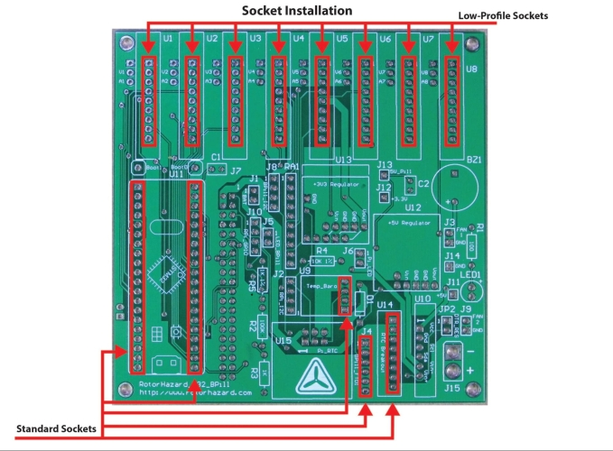
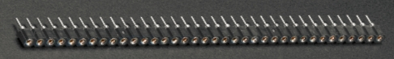
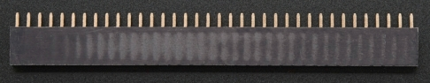

# Socket Headers for RotorHazard S32_BPill PCB

In the standard/recommended build of the S32_BPill board, socket headers are used at the locations shown below:

The recommended installation option for the RX5808 node boards is to use low-profile sockets in the U1-U8 (9-pin) locations on the PCB. Low-profile sockets may be found at [Mouser](https://www.mouser.com/ProductDetail/Mill-Max/801-93-036-10-012000?qs=WZRMhwwaLl%2F7W%252BkSMqBETQ%3D%3D) and [Adafruit](https://www.adafruit.com/product/3646) (where they are described as "Swiss Female Socket Headers"). These are shorter and have better contacts than standard socket headers.

If the low-profile sockets are used, the pins on the RX5808 node boards should be cut to a length of 3.5mm-4.0mm (as measured from the edge of the node PCB) -- the [Trimming Jig for RotorHazard S32_BPill Nodes](trimjig.md) can help with this.

Standard (taller) socket headers should be used at the remaining locations. They are available from many vendors, including [Adafruit](https://www.adafruit.com/product/598). An assortment kit like [this one from Glarks](https://www.amazon.com/Glarks-Straight-Connector-Assortment-Prototype/dp/B076GZXW3Z) can also be a good option.

 

---------------------------------------

Back to [RotorHazard S32_BPill PCB](README.md)