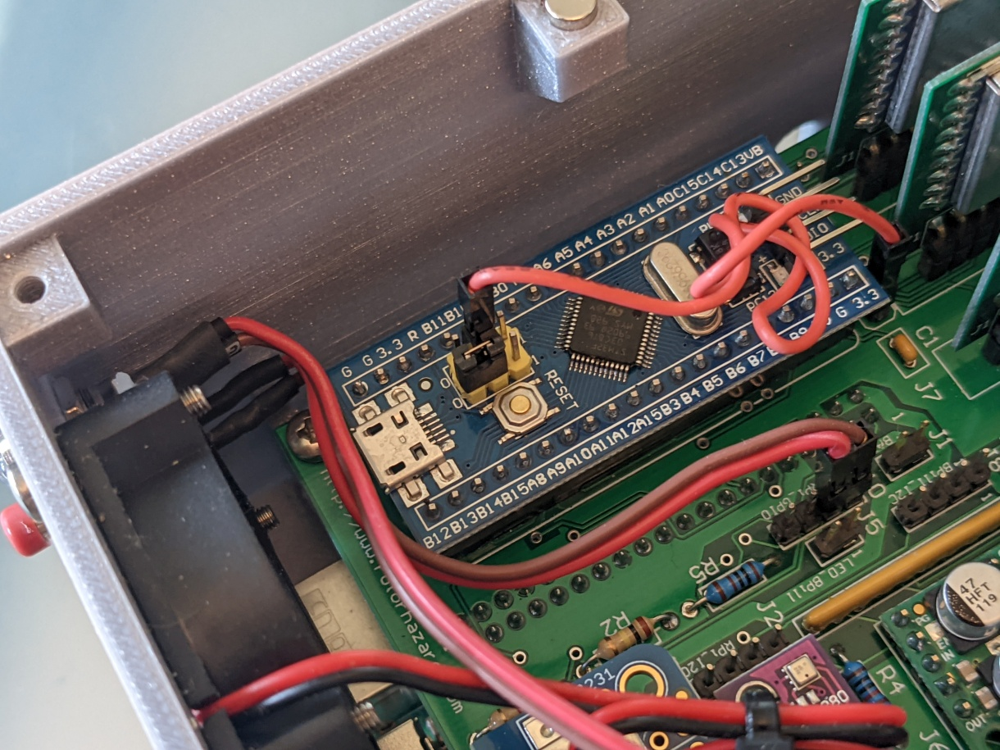

### RotorHazard S32_BPill Main Board Build

This guide provides step-by-step instructions for assembling components
onto a RotorHazard S32_BPill PCB. The
S32_BPill [schematic](https://github.com/RotorHazard/RotorHazard/blob/main/resources/S32_BPill_PCB/files/RotorHazard_S32_BPill_SCH_R1.pdf) also
provides valuable reference information.

Although the order of soldering the components to the main PCB is not
critical, these instructions are provided in an order of the components
with the lowest profile first.

#### ​1) Install the resistors

Install the resistors onto the board by bending the leads and pushing
them through the holes on either side of the resistor markings, turn the
board over, solder the leads and trim off the excess leads. 
100 ohm 5% to R1 
100k Ohm 5% to R2 
1k Ohm 5% to R3 
10k Ohm 1% to R4 
1k Ohm 1% to R5 
9x 100k SIP into RA1

There are two precision (1%) resistors that are placed in R4 and R5
locations. The 9x 100k SIP resistor array is soldered into RA1 location
with pin 1 at the indicated position with the arrow (toward the top as
shown). If you have never installed multi-pined components before, the
tip to installing them vertically is to use the one pin technique; which
is to solder one pin, ensure the component is vertical before soldering
the other pins. If it is not vertical, warm the one soldered pin and
hold the component vertical while the solder solidifies.

#### ​2) Install the diode and capacitors

Install the two capacitors at locations C1 and C2. Install the diode
making sure that the polarity is in the correct orientation with the
cathode (the line on the diode indicates the cathode) towards the bottom
of the board as shown. 
0.1 uF Capacitor to C1 and C2 
MBR 1100 1852 Diode to D1

 
#### ​3) Install the Socket Headers

Solder socket headers onto the main PCB at the locations shown below, using the
one pin first technique to ensure they are vertical.

The 20 pin sockets used for attaching the BPill need to be aligned.
Install them by first pressing them onto the BPill and soldering the
sockets in place while attached to the BPill.

The recommended installation option for the RX5808 node boards is to use
[low-profile sockets](https://github.com/RotorHazard/RotorHazard/blob/main/resources/S32_BPill_PCB/headers.md)
in the U1-U8 (9-pin) locations on the PCB. These are shorter and have
better contacts than standard socket headers. If the low-profile sockets
are used, the pins on the RX5808 node boards should be cut to a length
of 3.5mm-4.0mm (as measured from the edge of the node PCB) -- the
[Trimming Jig for RotorHazard S32_BPill
Nodes](https://github.com/RotorHazard/RotorHazard/blob/main/resources/S32_BPill_PCB/trimjig.md) can
help with this. 
See also: [RotorHazard S32_BPill Node Board Assembly](nodeAssembly.md)

Optional - Install the 6-pin socket at U14 for the FTDI breakout.

Optional - Install the 8-pin socket for the RTC Breakout at J4.

Optional - Install the 4-pin socket for the BME280 at U9 Temp_Baro box.

#### ​4) Install Pin Headers

Solder pin headers onto the main PCB at the locations shown below.
Installing pin headers vertically can be challenging. One technique is
to use a spare socket header to hold the pin(s). Press the pin into a
socket, push the pin through the board, turn the board over and solder
the pin while holding the socket. (See also the [Pin Soldering Helper doc](files/PinSolderingHelper.pdf).)
Use the single pin first technique to ensure they are vertical.

Installing a 2-pin header at the LED1 location will provide a connection
point for a panel-mount LED. Another option is to install an LED
directly onto the board, with the (+) pin (long lead) on the LED
connected to the top pad marked with a (+).

The 3x2 pin headers at U15 are for a DS3231 RTC module -- see the
“Real-Time Clock (RTC)” section below for more info.

#### ​5) Installation of the Voltage Regulators

Solder the straight pins to the back side of the 3v3 and 5v voltage
regulators (5 straight and 1 single pin). Be sure to keep the pins
straight using the solder-one-pin-first technique. When completed the
long side of the pins need to protrude out of the back.

Solder the regulators to the appropriate places on the main board -- the
5V regulator is installed at U12, and the 3.3V regulator is installed at
U13. The picture below (“RotorHazard S32_BPill Board with Regulators
and Current Sensor Installed”) can be used as a reference.

With the regulators shown there is little risk of swapping them since
the pinouts are different. However, the main PCB was designed to
accommodate other regulators. The figure below indicates where voltages
can be checked after the install is completed.

 
#### ​6) Installing the Current Sensor Module

The INA219 module provides voltage and current monitoring data. **This sensor is optional, but if one is not installed then a wire jumper needs to be soldered between the Vin+ and Vin- pins of the U10 pads** (as noted on the [schematic](https://github.com/RotorHazard/RotorHazard/blob/main/resources/S32_BPill_PCB/files/RotorHazard_S32_BPill_SCH_R1.pdf)).

If an INA219 is being installed, prepare the module by soldering right
angle pins to the component side of the board (see below). Make sure the
pins are parallel to the board using the one pin first technique.

Solder the current sensor module to the main PCB at position U10, making
sure that the pin designators correspond to those on the main board. If
the INA219 is installed backwards it will be destroyed.

When the voltage regulators and current sensor are installed, it should
look like this:

**RotorHazard S32_BPill Board with Regulators and Current Sensor Installed**

#### ​7) Optional - Install BME280

A barometer/temperature module may be added to the build with the main
purpose of measuring the internal temperature inside the case. Prepare
the BME280 module by soldering four straight pins to the module with the
pins on the back side of the module. Attach the module to the 4-position
socket at U9, taking care to align the pins with holes with the same
label.

#### ​8) Optional Real-Time Clock (RTC)

The board supports two types of Real-Time Clock (RTC) modules - '[DS3231
PiRTC](https://www.adafruit.com/product/4282)' (3x2 header pins at U15)
and '[DS3231 Breakout](https://www.adafruit.com/product/3013)'
(8-position socket at U14). Only one should be attached at a time.
Install by sliding the socket on the module over the pins on the main
PCB (PiRTC) or sliding the pins on the module into the socket on the
main PCB (DS3231 Breakout) taking care to align the pins to the sockets.
Note: The DS3231 module needs a
[CR1220](https://www.adafruit.com/product/380) coin cell battery.

#### ​9) Install XT30 and Ribbon Connector

Solder a male XT30 power connector to the back side of the PCB at the
J15 location. Make sure the flat side (+) is toward the bottom of the
board marked with a (+).

The 40-pin header is soldered on the back side of the board also -- be
sure to note Pin 1 at the top (typically marked with an arrow on the
header) and the location of the notch, facing left (see picture below).

When installing the ribbon cable, care should be taken to ensure the
proper alignment to Pin 1 on the RPi and on the main PCB.  Normally,
cables have the Pin 1 side indicated by a red stripe on the cable, but
some aftermarket cables have the red stripe on the wrong (pin 40) side.
 Pin 1 on the connector itself is almost always indicated by either a
raised or embossed triangle (which may require close inspection).

Because the pin header on the Raspberry Pi does not have a keyed shroud
it is very easy to insert the cable incorrectly.  There are indicators
for Pin 1, such as the use of a square pad on the Pi PCB, that help
ensure the correct ends are aligned.  But it is also important to make
sure that the connector is not installed shifted over by a row or
column. Inspect carefully before applying power, as incorrect
installation of the cable can result in permanent damage to the boards.

The header on the S32_BPill PCB is oriented so that (in the standard
configuration) the ribbon cable does not have to be twisted. A cable
length of around 10cm is close to optimal in that it allows some extra
to ease board installation while not taking up too much room in the case
when tucked in for the final assembly.

 

At this point it is recommended to apply a 12V supply to the XT30 and
verify that the proper voltages (+3.3V and +5.0V) exist on points
throughout the main PCB. Use of a smoke-stopper will help prevent damage
caused by any incorrect installation. The regulators are reverse-voltage
protected but the INA219 is not.

 
#### ​10) Install the buzzer

Install the buzzer by soldering the + pin the lower pad labeled (+). The
long pin on the buzzer is (+). Note that after applying power if the
buzzer is constantly beeping, it may be because the BPill is not yet
flashed. To silence it, put the clip on the '1' position of the Boot0
jumper on the BPill module and press the reset button on the BPill.
Leave the clip in place until the initial flash of the BPill is
completed. After that, the Boot0 wire jumper should be installed and
left in place (see below).

#### ​11) Boot Jumper

After completing the build and installing the BPill, remove the 2-pin header clip on the Boot0 pin and
connect a [jumper wire](https://www.adafruit.com/product/1951)
between the Boot0 pins on the BPill and the PCB. If you install the Boot0
jumper wire (and leave it installed) then the RPi will always be able to
flash the BPill. Without the wire the flashing will work if the RH firmware is
operational on the BPill (it has a jump-to-bootloader command), but if
not then you'd need to move the 2-pin header clip to the '1' position on
Boot0 (covering the pins designated as '3v3' and 'Boot0' in the pictures
below).

In addition to the wire jumper on Boot0, a 2-pin header clip must be present at the '0' position on Boot1
(covering the pins designated as 'Boot1' and 'GND' in the pictures below).

**Boot0 Wire Jumper Installed on Blue Pill Module**

 

Note: If you used a RobotDyn Black Pill Module, see the pics
[here](https://github.com/RotorHazard/rhfiles/raw/main/S32_BPill/mainBuildPics/image7.jpg) and
[here](https://github.com/RotorHazard/rhfiles/raw/main/S32_BPill/mainBuildPics/image8.jpg).

#### ​12) Assembled RotorHazard S32_BPill Board

 

Note: For WS2812b LED strip connect to J6 "Pi_LED" (near the middle of the board); pin 1 is ground, pin 2 is signal.

 

-------------------------------------------------------

See also: [RotorHazard S32_BPill Node Board Assembly](nodeAssembly.md)
