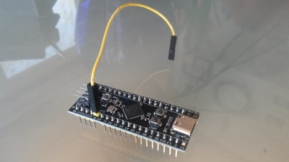

# STM32F4 Module on the S32_BPill PCB

The S32_BPill board (v1.0) was designed to use a [Blue Pill module](https://stm32-base.org/boards/STM32F103C8T6-Blue-Pill) with an STM32F103C8T6 processor, but with some simple modifications a [module](https://stm32-base.org/boards/STM32F411CEU6-WeAct-Black-Pill-V2.0) using an STM32F411CEU6 processor can be used instead. See the [WeAct "Black Pill"](https://github.com/WeActTC/MiniSTM32F4x1) for an example STM32F4 module.

Pin headers should be installed onto the STM32F4 module at all positions except for two: the "5V" pad at the corner of the module, and the "R" pin should left open:

If the module already has pin headers attached then those two pins should be cut off. (The above picture can also be used to verify the pinout of the module.)

***Important:*** The "5V" pad at the corner of the module corresponds to a power-ground pad on the S32_BPill (v1.0) board, so be sure that it is left open (not connected) on the module or bad things will happen. (The module will receive its power from the other "5V" pin.)

Install a single-pin header on the top side of the module at the "R" pad:

Install a single-pin header onto the S32_BPill board at the pad indicated below with the arrow:

(This pin provides access to the "RSSI_1" signal, coming from the first RX5808 module.)

Install the processor into the sockets for U11, and install two [jumper wires](https://www.adafruit.com/product/1951) as shown below:

The first jumper wire goes from the single-pin header that was installed on the S32_BPill board (at the pad indicated above with the arrow) to pin 3 of the J8 ("BPill_I2C") connector:

The second jumper wire goes from the single-pin header that was installed at the "R" pad on the module to pin 1 of the JP2 ("DTR_RES") connector:

For this processor and board (S32_BPill), the RotorHazard server must be version 3.1.0 or later. The RotorHazard server should be installed on the timer as per the instructions in '[doc/Software Setup.md](../../doc/Software%20Setup.md)'.

If this is the first time using the processor, its initial programming (flashing) should be performed as follows:

* Power up the timer and start the RotorHazard server (if it is not already running)

* Bring up the RotorHazard web GUI in a browser

* Use the `Update Nodes` button (in the 'System' section on the 'Settings' page) to display the "Update Node Firmware" page

* Click on the edit box for the firmware filename and change the "RH_S32_BPill_node.bin" part to "RH_S32_BPill_node_STM32F4.bin", making it like this: 
`/home/pi/RotorHazard/firmware/RH_S32_BPill_node_STM32F4.bin`

* On the processor module, hold down the BOOT0 button, press and release the NRST button, and then release the BOOT0 button

* On the web GUI, click on the `Update` button to flash-update the processor

Once the processor has been flash-updated the first time, future flash-updates can be performed by simply clicking on the `Update` button. The displayed processor type should be "STM32F4".

Note that the above flashing method will only work with an STM32F411CEU6 module. If another type of STM32F4 module is used or if the flashing fails, see the "src/node/[readme_S32_BPill.md](../../src/node/readme_S32_BPill.md)" file for instructions on building and flashing the code using the Arduino IDE. The module pinout should match what is shown above.

**Technical Notes:**

* Comparing the pinouts for the Blue Pill STM32F103C8T6 vs. the WeAct "Black Pill" STM32F411CEU6 module, the pins on one side are identical (pins 21-40), whereas on the other side pins 5-15 are shifted by one and the reset pin is moved. Most of these changes are handled in the node code (with the STM32_F4_PROCTYPE build option), but the jumper wires are needed to route the Reset and RSSI_1-to-B1 signals. See [here for a spreadsheet](files/RHNode_Pinout_F411CE_20210502.xlsx) with pinout information.

* When the STM32F4 module is used the J8 ("BPill_I2C") connector is not functional.

* Unlike the Blue Pill STM32F103C8T6, the WeAct "Black Pill" STM32F411CEU6 module does not have a BOOT0 header pin that can receive a jumper wire. The module instead has a BOOT0 button that may be pressed during power-on or reset to put the processor into bootloader mode. It should be possible to find the BOOT0 trace and solder on a jumper wire, if desired.

* Why do this? The STM32F4 can provide an increase in processing power for the node code, and there may come a time when the STM32F1 modules become difficult to acquire, so this provides another option and some potential "future-proofing".

 

---------------------------------------

Back to [RotorHazard S32_BPill PCB](README.md)