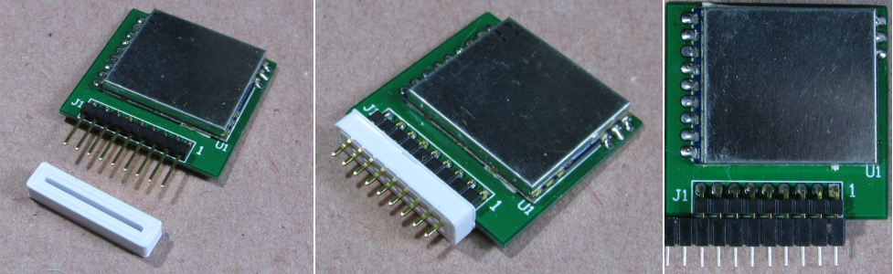

# Trimming Jig for RotorHazard S32_BPill Nodes

When the recommended [low-profile sockets](headers.md) are installed on the RotorHazard S32_BPill PCB, the pins on the mating node boards need to be trimmed to fit them. The needed length is 3.5mm-4.0mm (as measured from the edge of the node PCB).

A trimming jig may be 3D-printed using the '.stl' file below. It is placed over the pins during cutting, make it easy to trim them to the desired length.

[RH_S32_BPill_nodeTrimJig.stl](files/RH_S32_BPill_nodeTrimJig.stl)

Blender file:  [RH_S32_BPill_nodeTrimJig.blend](files/RH_S32_BPill_nodeTrimJig.blend)

The Trimming Jig for RotorHazard S32_BPill Nodes was created by David Hill

 

---------------------------------------

Back to [RotorHazard S32_BPill PCB](README.md)