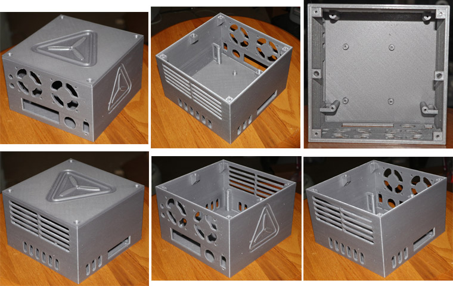

# RotorHazard S32_BPill Case

The RotorHazard S32_BPill case is the recommended enclosure to use with the [S32_BPill PCB](../S32_BPill_PCB/README.md). Inspired by existing designs, the S32_BPill case was created from scratch as a new project using [FreeCAD](https://github.com/FreeCAD/FreeCAD).

## Features

* Four mounting posts for attaching the S32_BPill PCB with screws (no separate mounting tray)

* Mounting posts for the Raspberry Pi on the bottom, with openings on the front and side for accessing Pi connectors

* Contains mounting holes for a power button, shutdown button, status LED, and (optional) fans

* Lid may be attached with screws, or magnets may be installed in provided mounts

* FreeCAD source project file available (see below)

## Resources

[RotorHazard S32_BPill Case Body \(with logo, 77mm tall\)](https://github.com/RotorHazard/rhfiles/raw/main/S32_BPill/case/RotorHazardCaseBodyBD77.stl) \[[preview](https://github.com/RotorHazard/rhfiles/blob/main/S32_BPill/case/RotorHazardCaseBodyBD77.stl)\]

[RotorHazard S32_BPill Case Lid \(with logo\)](https://github.com/RotorHazard/rhfiles/raw/main/S32_BPill/case/RotorHazardCaseTopBDyy.stl) \[[preview](https://github.com/RotorHazard/rhfiles/blob/main/S32_BPill/case/RotorHazardCaseTopBDyy.stl)\]

[FreeCAD Source Project File](https://github.com/RotorHazard/rhfiles/raw/main/S32_BPill/case/RotorHazardCaseBDyy.FCStd)

[Detailed RotorHazard S32_BPill Case Build Guide](detailedCaseBuild.md) (alt [PDF version](https://github.com/RotorHazard/rhfiles/blob/main/S32_BPill/case/RH_S32_BPill_CaseBuildInstructions.pdf))

Note: The 77mm-tall case is a good fit with the "standard" RotorHazard S32_BPill PCB build using [low-profile socket headers](../S32_BPill_PCB/headers.md) for the node modules. If standard socket headers are used for the node modules then the 81mm-tall case (below) can provide the extra height needed.

[RotorHazard S32_BPill Case Body \(with logo, 81mm tall\)](https://github.com/RotorHazard/rhfiles/raw/main/S32_BPill/case/RotorHazardCaseBodyBD81.stl) \[[preview](https://github.com/RotorHazard/rhfiles/blob/main/S32_BPill/case/RotorHazardCaseBodyBD81.stl)\]

[RotorHazard S32_BPill Case Body \(without logo, 77mm tall\)](https://github.com/RotorHazard/rhfiles/raw/main/S32_BPill/case/RotorHazardCaseBodyBD77_NoLogo.stl) \[[preview](https://github.com/RotorHazard/rhfiles/blob/main/S32_BPill/case/RotorHazardCaseBodyBD77_NoLogo.stl)\]

[RotorHazard S32_BPill Case Body \(without logo, 81mm tall\)](https://github.com/RotorHazard/rhfiles/raw/main/S32_BPill/case/RotorHazardCaseBodyBD81_NoLogo.stl) \[[preview](https://github.com/RotorHazard/rhfiles/blob/main/S32_BPill/case/RotorHazardCaseBodyBD81_NoLogo.stl)\]

[3D CAD Rendering of RotorHazard S32_BPill Case Body](files/RotorHazard_S32_BPill_Case_3D.pdf)

## Notes

* The case top will probably print best if it is inverted on the print bed.

* Changes to the design may be implemented by editing the FreeCAD source project file and regenerating the STL files. The design is highly parameterized and many of the dimensions can be altered by simply changing a number in the spreadsheet that is part of that source project.

* A page for this case has been posted on Thingiverse: https://www.thingiverse.com/thing:4733410

 

The RotorHazard S32_BPill case and detailed build guide were developed by Bob Duris
